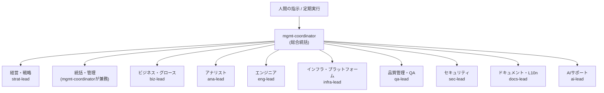

# Hermit Works

システム開発（Web / デスクトップ / モバイル）向けの Claude Code プラグインです。  
**10グループ・51名の専門家エージェント**が人間の指示や定期的な指示を受けて作業を分担し、利用者側のAI資産（CLAUDE.md・スキル・コマンド等）を育てる仕組みを備えます。

> 本ドキュメントは**プラグインを利用する方**向けです。  
> リポジトリの保守・開発に参加する方は [DEVELOPMENT.md](DEVELOPMENT.md)（保守ガイド）と [CONTRIBUTING.md](CONTRIBUTING.md)（追加・変更手順）を参照してください。

## プラグインの全体像

### できること
- 専門家エージェントによる作業の分担・並列実行（担当は「組織図」を参照）
- 生成担当と評価担当を分離した品質ゲート（`qa-review`・`sec-audit` 等によるレビュー→差し戻し→再評価。上限3回）
- 計画ファイル（`.hw/plans/`）による進捗管理と、中断した案件の再開
- 利用者側リポジトリの既存規約・資材（CLAUDE.md・コーディング規約・スキル等）を、本プラグインの一般方針より優先して従う運用
- 資産が何もないリポジトリでも `/hw:init` で作業ディレクトリと共有知識（構成マップ・利用者資材マップ）を整え、そこから育て始められる（詳細は次の「インストール」を参照）
- 資産が増えて乱立したリポジトリでも `/hw:optimize-assets`（構成の統廃合）・`/hw:audit-assets`（品質レビュー）で棚卸し・最適化から入れる（手順は「既存のAI環境がある場合の導入手順」を参照）
- 定型的な案件は完了時に手順を `.hw/procedures/` へ蒸留し、機械的な繰り返し作業は手順の昇格前なら既定の配置先（`.hw/scripts/`）に限り承認不要でスクリプト化し（利用者側の配置先を使う場合のみ提案・承認）、再利用実績を積んだ手順は利用者の承認を得て正式スキルへ昇格する（成長ループ。詳細は「作業ディレクトリ規約」を参照）

### できないこと
- コード実行基盤・CI/CDの提供（本プラグインはエージェント・コマンド・スキル等の定義資材で構成され、実行環境そのものは提供しません）
- 利用者側の資材（CLAUDE.md・`.claude/` 配下の設定等）の承認なしの変更
- トークン消費の抑制（分担・品質ゲートによる多段処理は、その分のトークンを消費します）
- 使用するモデルの能力を超える判断・成果の保証
- 利用者環境の実行時ハード制約（サンドボックス・権限設定）の代替

### セキュリティに関する注意
- 実行時に危険な操作を機械的に阻止する仕組みはなし（本プラグインはエージェントの役割定義・品質ゲート・作業手順を記述したプロンプト資材）
- 実行環境の隔離、認証情報ファイル（各種 CLI 設定・鍵ファイル等）や外部通信へのアクセス制御は利用者自身が用意（Claude Code 側の権限設定で対応）
- 設定テンプレートの同梱・強制はなし（具体的な設定は環境・Claude Code のバージョンにより異なるため。同梱 hooks を採用しない設計判断は DESIGN.md 2.3 を参照）
- プロンプトインジェクション・誤作動の完全な防止は不可（エージェントの共通ガードレールはプロンプト上の規範。破壊的操作・秘密情報の取り扱いに関する最終確認・承認は利用者自身の責任）
- 本プラグイン自体の脆弱性・懸念の連絡先: 著作権者（support@bizhermit.com）

### 導入メリット
- エージェントの役割定義・品質ゲート・計画ファイル運用が資材として同梱されているため、組織体制を自前で設計・構築する必要がなく、インストールと `/hw:init` で利用開始できる
- 計画ファイルに判断根拠・経緯が残るため、後日のレビューや担当交代時の引き継ぎがしやすい
- 品質ゲートの記録（差し戻し回数・指摘の重要度）が案件履歴に残るため、対応状況を後から確認できる
- 資産のライフサイクル（作成→棚卸し→最適化→蒸留→昇格）を回す仕組みが同梱されているため、CLAUDE.md やスキルがリポジトリの成長とともに増えても、散らかったまま放置せず整理しながら育てられる

## インストール

マーケットプレイス経由でインストールします。用途に応じて3つのスコープから選べます。  
`claude plugin marketplace add` と `claude plugin install` の `--scope` は必ず揃えてください
（省略時は既定の `user` になります）。

- **端末で常時使う（`user` スコープ・既定）**: `~/.claude/settings.json` に記録され、全プロジェクト・全セッションで有効になります。

  ```bash
  claude plugin marketplace add bizhermit/hermit-works --scope user
  claude plugin install hw@hermit-works --scope user
  ```

- **プロジェクトでチーム共有する（`project` スコープ）**: 対象プロジェクトの `.claude/settings.json` に記録されます。コミットすればチームで共有できます。

  ```bash
  claude plugin marketplace add bizhermit/hermit-works --scope project
  claude plugin install hw@hermit-works --scope project
  ```

- **プロジェクトで自分だけ使う（`local` スコープ）**: 対象プロジェクトの `.claude/settings.local.json` に記録されます。Claude Code が `.claude/settings.local.json` を自動で `.gitignore` に追加するため、コミット対象にはなりません。

  ```bash
  claude plugin marketplace add bizhermit/hermit-works --scope local
  claude plugin install hw@hermit-works --scope local
  ```

`project` / `local` スコープは対象プロジェクトの `.claude/` 配下に記録されるため、
**リポジトリのルートでセッションを開始した場合のみ**有効になります（サブディレクトリで
起動すると読み込まれません）。`user` スコープにこの制約は適用されません。

インストール後は次のコマンドで状態を確認できます。

```bash
claude plugin list
claude plugin details hw
```

導入したら、まず対象リポジトリで `/hw:init` を実行してください。作業ディレクトリ（`.hw/`）と、全エージェントの共有前提知識になるマップ類（プロジェクト構成マップ・利用者資材マップ）がまとめて作成されます。

## 更新

次のコマンドで最新化してください。

```bash
claude plugin update
```

カタログ自体を更新する場合は `/plugin marketplace update hermit-works` を実行してください。セッション中に反映させたい場合は `/reload-plugins` を実行します。

サードパーティマーケットプレイスの自動更新はデフォルトで無効です。  
有効にしたい場合は、マーケットプレイスを登録したスコープの設定ファイル（`--scope user` なら `~/.claude/settings.json`、`--scope project` なら `.claude/settings.json`、`--scope local` なら `.claude/settings.local.json`）の `extraKnownMarketplaces` で該当マーケットプレイスに `"autoUpdate": true` を設定してください。

## 使い方

| コマンド | 用途 |
|---|---|
| `/hw:init` | 初期セットアップ。作業ディレクトリと各種マップ（構成・利用者資材）をまとめて作成 |
| `/hw:request <内容>` | 案件を依頼。統括が解析→計画→専門家へ分担→統合報告 |
| `/hw:plan <内容>` | 計画（タスク分解・担当割当・リスク）のみ作成 |
| `/hw:standup` | 進捗の状況報告（スタンドアップ） |
| `/hw:review [対象]` | 品質＋セキュリティ＋テスト観点の総合レビュー |
| `/hw:report` | 定期レポート（進捗・品質・セキュリティ・技術負債）。定期実行向け |
| `/hw:audit-assets [対象]` | 利用者側の規約・資材（CLAUDE.md・スキル・スクリプト等）のレビューと是正・改善提案 |
| `/hw:optimize-assets [対象]` | 既存AI資材の構成最適化。本プラグインとの適合性分析（役割重複・指示の矛盾・分散）と乱立資材の統廃合 |
| `/hw:draft-docs [対象]` | 利用者リポジトリの開発文書（仕様書・コーディング規約・README等）の不足・陳腐化を検出し、実装を一次情報にドラフトを作成して承認後に配置 |
| `/hw:routine <要望>` | 定期実行（毎朝スタンドアップ等）のセットアップ |
| `/hw:show-org [関心領域]` | 組織図の表示と使い方案内 |
| `/hw:help [関心領域]` | コマンド・スキル一覧の表示と使い分けの案内 |

資材の**構成**を統廃合したい場合は `/hw:optimize-assets` を使ってください。  
資材の**品質**をレビューしたい場合は `/hw:audit-assets` を使ってください。  
両者を組み合わせて使う場合の適用順は「既存のAI環境がある場合の導入手順」節を参照してください。  
開発文書（仕様書・README等）の不足・陳腐化に気付いた時点では、随時 `/hw:draft-docs` を使ってください。

特定の専門家に直接依頼する場合は `@hw:<エージェント名>`（例: `@hw:eng-backend`）で言及するか、依頼内容に専門領域を明記してください。

### コマンド未指定プロンプトの扱い（一次受けの振り分け）

コマンドを指定しないプロンプトも内容に応じて組織フローに乗せたい場合は、利用側リポジトリの CLAUDE.md に以下のような振り分け方針を追記してください（`/hw:init` 実行時にも、未記載であれば追記を提案します）。すべてのプロンプトを無条件に `/hw:request` 扱いにすることは推奨しません——質問や会話途中の応答にまで統括・計画・品質ゲートのオーバーヘッドがかかるためで、hooks 等で機械的に強制する方式も同じ理由で採用していません。

```markdown
## hermit-works への振り分け（一次受け）
コマンド・スキル・エージェントの指定がないプロンプトは、内容を見て次のように扱う。
- コード変更を伴う依頼、複数工程・複数プロジェクトにまたがる依頼 → `/hw:request` のフローに準じて対応する
- 質問・相談・軽い調査 → 直接対応してよい。ただし専門的な分析を要する調査は `/hw:request` に流す
- 軽微な1ファイル修正 → 直接対応してよい。ただし認証・認可・秘密情報・公開範囲・データスキーマ・課金等高リスク箇所に触れる場合は `/hw:request` に流す
- 迷う場合は、どちらで進めるかを一言添えてから着手する
```

## 組織図（エージェント一覧）

| グループ | エージェント | 担当分野 |
|---|---|---|
| 経営・戦略 | `strat-lead` | 戦略判断の論点整理・最終見解取りまとめ |
|  | `strat-product` | プロダクト戦略・機能優先順位付け |
|  | `strat-tech` | 技術選定・技術負債への投資判断 |
|  | `strat-portfolio` | 複数プロジェクトの優先度・リソース配分 |
|  | `strat-roadmap` | 中長期計画・マイルストーン管理 |
| 統括・管理 | `mgmt-coordinator` | 指示の解析・分担・統合の総合統括（組織全体のオーケストレーター） |
|  | `mgmt-pm` | 進捗・課題・ブロッカーの管理 |
|  | `mgmt-planner` | タスク分解（WBS）・見積り・割当案 |
|  | `mgmt-release` | リリース計画・可否判定・切り戻し準備 |
|  | `mgmt-risk` | リスクの洗い出し・評価・台帳管理 |
| ビジネス・グロース | `biz-lead` | ビジネス施策の統合・優先順位決定 |
|  | `biz-marketing` | 訴求文案・SEO/ASO・対外表現 |
|  | `biz-growth` | ファネル分析・KPI改善施策・A/Bテスト |
|  | `biz-cs` | ユーザー声の分析・FAQ整備・問い合わせ削減・障害時のユーザー対応 |
| アナリスト | `ana-lead` | 分析方針決定・結果の統合と品質担保 |
|  | `ana-requirements` | 要件定義・受け入れ基準・矛盾検出 |
|  | `ana-domain` | ドメインモデル・用語・サービス境界分析 |
|  | `ana-data` | ログ・DBの集計分析と示唆出し |
|  | `ana-metrics` | KPI設計・イベント計測設計と監査 |
| エンジニア | `eng-lead` | 技術判断の最終決定・難問解決・技術レビュー |
|  | `eng-architect` | 全体アーキテクチャ・サービス境界・通信方式設計 |
|  | `eng-api` | API契約設計・バージョニング・後方互換性 |
|  | `eng-frontend` | Web UI実装・状態管理・表示性能改善 |
|  | `eng-backend` | サーバーサイド実装・バグ修正 |
|  | `eng-mobile` | iOS/Androidアプリ実装・モバイル固有対応 |
|  | `eng-desktop` | デスクトップアプリ実装・配布/自動更新 |
|  | `eng-db` | データモデル設計・マイグレーション・クエリ最適化 |
|  | `eng-data` | ETL/ELT・DWH/データマート等データ基盤の構築・運用 |
|  | `eng-design` | UI/UX情報設計・ワイヤーフレーム・デザインシステム定義 |
| インフラ・プラットフォーム | `infra-lead` | インフラ方針決定・コスト/信頼性の判断 |
|  | `infra-devops` | CI/CDパイプライン構築・ビルド自動化 |
|  | `infra-cloud` | クラウドリソース設計・IaC・コスト最適化 |
|  | `infra-sre` | 監視/SLO設計・障害対応・ログ基盤 |
|  | `infra-container` | Docker/K8s構成・イメージ最適化 |
| 品質管理・QA | `qa-lead` | 品質基準策定・テスト戦略決定・品質総括 |
|  | `qa-test` | テスト設計・自動テスト実装・回帰整備 |
|  | `qa-review` | コードレビュー（読取専用・指摘のみ、修正は行わない） |
|  | `qa-perf` | 負荷テスト・ボトルネック分析・性能改善提案 |
|  | `qa-a11y` | WCAG準拠のアクセシビリティ監査 |
| セキュリティ | `sec-lead` | セキュリティ方針・脅威モデリング・重要度判定 |
|  | `sec-audit` | 脆弱性診断・秘密情報混入チェック（診断専任・修正不可） |
|  | `sec-appsec` | 脆弱性修正実装・認証/認可・入力検証強化 |
|  | `sec-privacy` | 個人情報の取り扱い監査・法令/規約チェック |
| ドキュメント・L10n | `docs-lead` | 文書体系設計・品質基準・文書負債管理 |
|  | `docs-tech` | 設計書・API仕様書・ADRの執筆と整合確認 |
|  | `docs-user` | マニュアル・FAQ・ユーザー向けリリースノート |
|  | `docs-l10n` | UI文言翻訳・i18nリソース・国際化対応 |
| AIサポート | `ai-lead` | AI機能の企画評価・モデル/方式選定方針 |
|  | `ai-prompt` | プロンプト設計・改善・評価基準作成 |
|  | `ai-ml` | 推薦/分類/検索等ML機能の実装と精度改善 |
|  | `ai-integration` | LLM API組み込み・信頼性/コスト最適化 |

以下は指示がどう伝わるかの階層構造です（個々の専門家の担当は上表を参照）。



各グループの `*-lead` がグループ内の方針判断を担います。ただし統括・管理グループにはグループ専属のリードがなく、`mgmt-coordinator` が組織全体の振り分けとグループ内の方針判断を兼務します。

### ワークフロー設計（5原則）

統括（`mgmt-coordinator`）と各 `*-lead` は、指示を受けると以下の5原則で処理フローを設計してから作業に入ります。

1. **直列分解（チェーン）** — タスクを順序付きの小ノードに分解し、前ノードの出力を次ノードの入力として流す
2. **ルーティング（分岐）** — 指示の性質（不具合修正・新機能・調査・定型作業等）を判定し、種類別に処理経路を分ける
3. **並列化** — 独立した作業は複数エージェントで同時並列に処理し、最後に統合する
4. **司令塔と専門家** — 統括・リードが司令塔として専門家に作業を割り振り、結果を統合する（司令塔は実作業をしない）
5. **評価ループ** — 生成ノードと評価ノード（`qa-review` `sec-audit` 等）を分離し、指摘→改善→再評価のループを回す（上限3回）

### モデル割り当て

トークン量を適正化するため、各エージェントにモデルを指定しています。`opus` の判定は役職名ではなく「判断の不可逆性・波及範囲」で決めます（判断を誤ったとき下流のやり直しが広範に及ぶ役割が対象。詳細は CONTRIBUTING 2.5 参照）。

| モデル | 対象 | 位置づけ |
|---|---|---|
| `opus` | `mgmt-coordinator`・各 `*-lead`（9体）・`eng-architect` | 高度な判断・設計を担う最上位層 |
| `sonnet` | 上記以外の40体 | 実装・分析・レビュー・監査等の実務中核 |
| `haiku` | 現時点で該当なし | 判断を含まない集計・整形等の軽量タスク限定（採用基準は CONTRIBUTING 2.5 参照） |

※ `/hw:request` 等のコマンド自体はメイン会話で動くため、そのモデルはセッション設定（`/model`）に従います。統括をサブエージェントとして呼び出した場合（`@hw:mgmt-coordinator`）は `opus` が使われます。

## スキル（作業手順書）

| スキル | 用途 |
|---|---|
| `hw:repo-map` | プロジェクト構成マップ（`.hw/repo-map.md`）の作成・更新 |
| `hw:conventions` | 利用者資材マップ（`.hw/conventions.md`）の作成・更新 |
| `hw:add-service` | 新規プロジェクト（マイクロサービス）の追加手順 |
| `hw:incident` | 障害対応標準手順（トリアージ→復旧→ポストモーテム） |
| `hw:tracker-setup` | 外部進捗管理ツール連携（`.hw/tracker.md`）の初期設定・見直し・停止 |
| `hw:tracker-sync` | 外部進捗管理ツール連携の課題取得・スナップショット・投稿の実行（`/hw:request` から呼び出し） |
| `hw:stakeholders` | 関係者マップ（`.hw/stakeholders.md`）の作成・更新 |
| `hw:export-assets` | 成長したAI資産（手順資産・スクリプト・昇格済みスキル）を他リポジトリへ横展開するためのエクスポート手順。資産一覧の分類提示と利用者選択・混在資産の切り離し・秘密情報チェックを経て、.hw/export/ に zip とマニフェストを生成する。資産を他リポジトリへ持ち出したいときに使う。 |
| `hw:import-assets` | hw:export-assets で生成された資産zipを取り込むインポート手順。マニフェスト確認・衝突時の4択（上書き・スキップ・別名保存・マージ草案）を経て、手順資産として実績リセット・出自記録付きで .hw/procedures/ へ配置する。展開元の資産を取り込むとき・再取り込みするときに使う。 |

## 利用者側の規約・資材への準拠

全エージェントは、利用対象のリポジトリに用意された利用者側の規約・資材（CLAUDE.md・コーディング規約・出力形式の指定・スキル・コマンド・スクリプト・テンプレート等）を、本プラグインの一般方針より**優先して**従います。該当する定型作業に利用者側のスキル・スクリプトがあれば、自前の手順を組み立てずそちらを使います。

- 資材が多い・分散している場合は、`hw:conventions` スキルで**利用者資材マップ**（`.hw/conventions.md`）を作成しておくと、全エージェントが索引として参照します。
- 利用者側資材の品質に不安がある場合は、`/hw:audit-assets` で専門家（プロンプト品質・文書体系・コード品質・セキュリティ・CI構成の各観点）によるレビューと是正・改善提案を受けられます。**利用者の資材は承認なしに変更しません**。エージェントが作業中に規約への準拠に品質・セキュリティ上の懸念を見つけた場合も、黙って従わず懸念を報告します。

### 既存のAI環境がある場合の導入手順

既にAI環境を運用しているリポジトリ——Claude Code 導入済みで CLAUDE.md・独自のスキル/コマンド/
エージェントが増えて乱立している場合も、他ツール向け設定（Cursor / GitHub Copilot 等）が
ある場合も——では、以下の順で本プラグインに合わせた最適化を行えます。

1. `/hw:init` — 作業ディレクトリの作成と資材の索引化（プロジェクト構成マップ・利用者資材マップの作成）
2. `/hw:optimize-assets` — 資材**構成**の最適化。本プラグインとの適合性（役割の重複＝独自エージェント/
   コマンドと hw 組織の被り、指示の矛盾＝CLAUDE.md と hw ワークフローの衝突、指示の分散＝他ツール向け
   資材にだけある規約、動作の阻害＝permissions / hooks）に加え、利用者資材**同士**の乱立（重複・断片化・
   死蔵）も検出し、承認のうえで統廃合・移行します
3. `/hw:audit-assets` — 残した資材の**品質**のレビュー（曖昧さ・バグ・安全性・保守性）と是正
4. 以後、資材を追加・変更したら `hw:conventions` スキルでマップを更新します（`/hw:routine` で定期点検の
   自動化も可能です）

いずれの段階でも、利用者の資材が承認なしに変更されることはありません。

## 作業ディレクトリ規約

エージェントの成果物は、対象リポジトリの `.hw/` 配下に保存されます。

```
.hw/
├── repo-map.md       # プロジェクト構成マップ（全エージェントの共有前提知識）
├── conventions.md    # 利用者資材マップ（利用者側の規約・スキル・スクリプトの索引）
├── routines.md       # 定期実行の登録記録
├── decisions.md      # 判断記録（1判断1行の軽量ADR。統括が利用者確認のうえ記録）
├── tracker.md        # 外部進捗管理ツール連携の設定（存在時のみ連携が有効。hw:tracker-setup）
├── stakeholders.md   # 関係者マップ（事実情報・宛先別執筆規約。hw:stakeholders）
├── procedures/       # 手順資産（案件から蒸留した再利用可能な手順。1手順1ファイル）
├── scripts/          # 手順資産から生成したスクリプトの既定配置先（初回作成時に生成。昇格前の作成は承認不要）
├── export/           # hw:export-assets が生成する一時搬送物（zip・マニフェスト。gitignore対象・非コミット）
├── imports/          # hw:import-assets の取り込み記録（出自リポジトリ名・移入日ごとに1ファイル）
├── plans/            # 案件ごとの計画（/hw:request / /hw:plan が作成）
├── reports/          # スタンドアップ・定期レポート・リリース判定・障害記録
├── tracker/
│   └── issues/       # 外部課題のスナップショット（tracker.md 有効時のみ。hw:tracker-sync）
├── docs/             # その他の組織成果物
└── local/            # 個人ローカルの主観メモ（.gitignore 対象。既定で未読込）
```

`procedures/` は成長ループ（参照→実行→蒸留→昇格）の蓄積先です。定型的な案件は完了時に統括が手順資産へ蒸留し、
次回以降の同種依頼では既存の手順資産を優先的に参照・再利用します。蒸留・再利用の際に判断を含まない機械的な
反復ステップが見つかった場合は、手順の昇格前なら既定の配置先（`.hw/scripts/`）に限り承認不要でスクリプト化し、利用者側の配置先を使う場合のみ統括が提案し承認を得ます。再利用実績を重ねた手順は、利用者の承認を得て
`.claude/skills/` の正式スキルへ昇格します。`tracker.md`・`tracker/issues/` は外部進捗管理ツール連携（`hw:tracker-setup`）を導入したリポジトリにのみ生成されます。
`stakeholders.md`・`local/` は `hw:tracker-setup` 経由でも、`hw:stakeholders` の単独利用でも生成されうるため、
tracker 連携を導入していないリポジトリにも存在する場合があります。

育てた手順資産・スクリプト・昇格済みスキルは、`hw:export-assets`（エクスポート）・`hw:import-assets`
（インポート）で他リポジトリへ横展開できます。`export/` はコミットしない一時搬送物、`imports/` は
取り込み記録の保存先です。展開先では実績をリセットし手順資産から育て直します。分類提示・混在資産の
切り離し・衝突解決・秘密情報チェック等の詳細は各スキルに委譲します。

手順資産・スキルに合致しない初出の依頼パターンでは、統括が計画立案前に進め方（AI提案・カスタム・
二人三脚・おまかせ）を確認してから計画に進みます。未昇格の手順資産のみ合致する場合は、その手順を
推奨案として提示し、進めてよいか確認できます。

## 開発・保守に参加するには

- [DEVELOPMENT.md](DEVELOPMENT.md) — 開発環境（devcontainer）・プラグインの読み込みの仕組み・検証手順
- [CONTRIBUTING.md](CONTRIBUTING.md) — エージェント/コマンド/スキルの追加・変更手順と規約
- [DESIGN.md](DESIGN.md) — 設計思想・主要な設計判断の内容と背景（なぜそう設計したか）

## ライセンス

本プラグインは [CC BY-ND 4.0](LICENSE)（クリエイティブ・コモンズ 表示 - 改変禁止 4.0 国際）で提供されます。

- **利用は自由です。** 商用・非商用を問わず（企業の開発現場での利用を含む）、複製・原型のままの再配布ができます（著作権表示が必要です）
- **本プラグインを使用して開発された成果物**（サービス・コード・文書等）**にライセンスは及びません。** 非公開・商用化を含め完全に自由です
- 改変して手元（社内・私的利用の範囲）で使うことは自由ですが、**改変版の公開・再配布はできません**
- 改変版の公開・再配布を希望する場合は、著作権者（support@bizhermit.com）に連絡してください。個別に許諾できます

貢献（Pull Request）のライセンス条件とクレジットの扱いは [CONTRIBUTING.md](CONTRIBUTING.md) の7章を参照してください。
