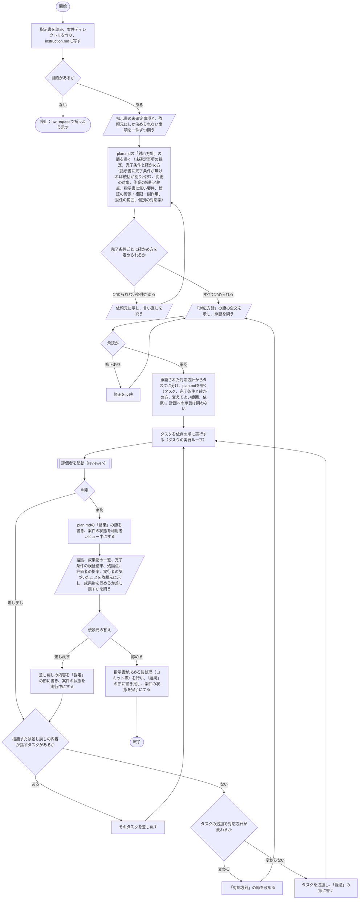
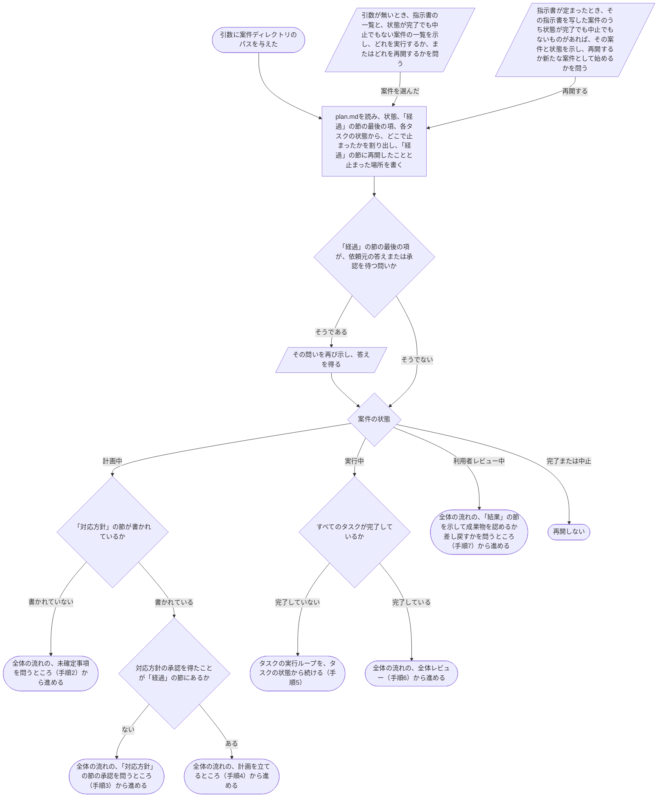
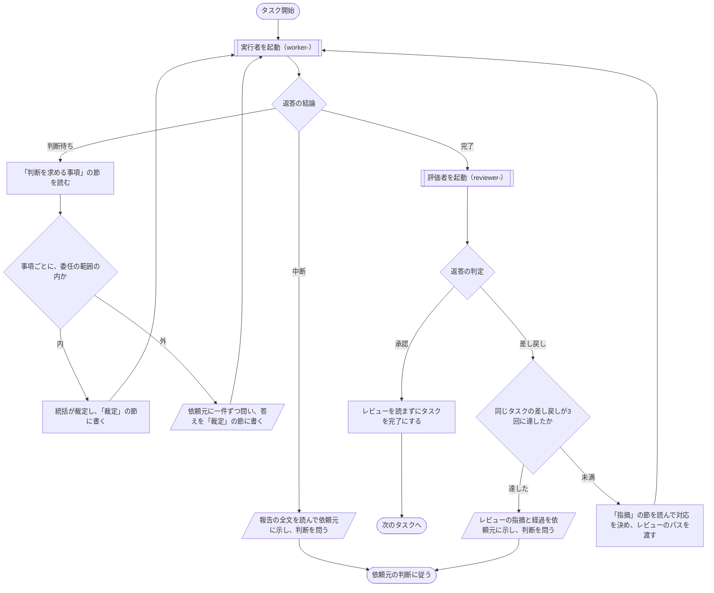

# hw:execute

指示書（`hw:request`が作成したもの、または`hw:request`以外の手段で書かれたもの）を受け、対応方針を立てて依頼元の承認を得たうえで、実行計画を立て、計画のタスクごとに実行者に実施させ、評価者のレビューを経て成果物を仕上げる。手順は[SKILL.md](../../../plugin/skills/execute/SKILL.md)に定めてあり、本書はその入出力、設計の判断、処理フローを示す。

## 入出力

- **入力**：引数（指示書のパス、課題の識別子、または再開する案件ディレクトリのパス）、指示書（`hw:request`が作成したもの、または`hw:request`以外の手段で書かれたもの）、対話での答え、定められた規則のうち外部トラッカーの使用を定めた記述
- **出力**：成果物（指示書の制約の内で、計画の変えてよい範囲に書いた場所への変更）と、案件ディレクトリの記録（指示書の写し、対応方針、実行計画と経過、タスクごとの報告とレビュー、全体レビュー）。雛形は`plugin/skills/execute/templates/`
- **担当**：実行者`hw:worker`と評価者`hw:reviewer`。いずれも統括（本スキルを実施する人物）が`Agent`ツールで起動するサブエージェント

## 設計の判断

- 指示書をそのまま実行せず、対応方針を立てて依頼元の承認を得てから実行計画を立てる。指示書は依頼元の要望を書いたものであり、現状をどう変えれば目的を達成できるかは統括が具体化する部分である。具体化した内容を、依頼元が確かめられる形（`plan.md`の「対応方針」の節）に書いてから作業を進めることで、依頼と統括の解釈の区別を保つ。承認は対応方針について得て、計画については依頼元に承認を問わない。計画を立てる前に承認を得ておき、計画を立ててからは承認を問うために止まらずに進めるためである。計画を変える（タスクの追加、削除、完了条件や範囲の変更）とき、対応方針も変わるなら、変えた対応方針を依頼元に示して承認を得る。対応方針が変わらなければ、変えた内容を「経過」の節に書いて進む。指示書に無い要件が目的の達成に要ると統括が判断したときは、統括が加えたものと分かる形で「対応方針」の節に書き、承認を得たものだけを加える。指示書を書いた時点では分かっていなかった要件はありうるが、依頼と解釈の区別は保つためである。
- 指示書に目的が無ければ停止するが、完了条件が無くても停止しない。完了条件は統括が指示書から割り出し、統括が割り出したものと分かる形で「対応方針」の節に書き、依頼元が対応方針を承認するときに確かめる。指示書は`hw:request`で作られたとは限らず（人間が直接書いたGitHub Issue等）、どう対処するか（完了条件を含む）は対応方針で定めるためである。目的は完了条件を割り出すもとであり、無ければ計画を立てられない。
- 境界は、指示書の制約と、承認された対応方針に基づいて計画に書いた変えてよい範囲である。指示書の対象範囲や依頼元の意見は、対応方針で変更の対象（どの現物を変えるか）を定めるときの材料であり、目安であって境界ではない。どう対処するかは対応方針で定め、依頼元の承認で確かめるためである。
- 統括が行うのは、対応方針を立てること、計画を立てること、担当を起動すること、判定すること、依頼元と対話することだけであり、成果物は自分で作らない。作る人物と確かめる人物と判定する人物を分けることで、自分が作ったものを自分で承認しないようにする。
- タスクは成果物と完了条件が一つに定まる単位に分け、完了条件は現物で確かめられる形で書く。評価者が、意見ではなく現物を確かめた結果に基づいて判定するようにするためである。
- 担当は起動するたびに別の人物になり、前回の内容は記録で渡す。評価者は実行者の報告を信用せず自分で現物に当たる。記録をファイルに残すのは、担当が会話の文脈を持たないためと、判定の根拠を後から辿れるようにするためである。
- 担当は記録を書き先に自分で書き、返答は一行（実行者は結論とパス、評価者は判定、指摘と提案の件数、パス）だけを返す。統括が全文を返答で受け取って書き写すと、同じ全文が統括のコンテキストに二度載り（受け取った返答と、`Write`の引数）、写すための出力も要る。担当が書けば、全文を生成するのは担当の一回だけで、統括のコンテキストには読んだ分だけが載る。
- 統括が記録を読むのは、次に何をするかを決めるのに要る節だけである。判断待ちなら「判断を求める事項」の節、差し戻しなら「指摘」の節、最後の報告では全体レビューの「完了条件の検証」の節と、提案のあるレビューの「提案」の節を、見出しを手がかりに抜き出して読む。判定が承認のレビューは、読まずにそのまま受け入れる。評価者のレビューをさらに確かめ始めると、確かめる作業が終わらなくなるため、評価者の自己点検に任せる。
- 担当の一時ファイルは、統括が渡す一時領域（`tmp/worker-<n>/`、`tmp/reviewer-<n>/`）に置く。一時ファイルが要るかどうかは作業と対象によって変わるため禁じず、置き場を`.hw/cases/`の下に限る。役割と回ごとに分けるのは、評価者が、実行者が確かめるために作ったファイルを使い回さず、自分で現物に当たるためである。
- 記録の名前は書いた役割で付ける（`worker-<n>.md`、`reviewer-<n>.md`）。Claude Codeのハーネスは、サブエージェントが`Write`で`report`、`summary`、`findings`、`analysis`で始まる`.md`を書くことを拒む（2.1.274の実行ファイルで確かめた。公式の説明は無い）。役割の名前で付ければ、この拒否に当たらない。これは「報告は返答で返せ」というガードレールを避ける形であり、依頼元がそれを承知で選んだ。
- レビューの判定は承認と差し戻しの二値であり、差し戻しの根拠は、完了条件が満たされていないまたは現物で確かめられない、変えてよい範囲の外に変更がある、報告の記述が現物と一致しない、の三つに限る。重大度の段階や観点の一覧は持たない。判定の基準を計画（完了条件と範囲）に固定し、評価者の裁量で基準が増えないようにするためである。該当しない指摘は提案として残し、採り入れるかは依頼元が決める。
- 指摘と提案には確度（0から100）を付ける。確度は判定に用いず、その内容が成り立つと評価者が判断する度合いを示す。提案には完了条件の外にある不具合と好みの改善が同じ形で並ぶため、依頼元が採り入れるかを決めるときに、事実と好みを見分ける材料として付ける。
- 評価者には実行者と同じ制約を渡す。制約を知らない評価者は、制約のために選ばれた手段や制約のために変更されなかった点を、完了条件の未達や改善の余地として指摘してしまうためである。
- 差し戻しの繰り返しは同じタスクで3回までとし、それに達したら依頼元に判断を問う。差し戻しが繰り返される原因は計画（完了条件や範囲の書き方）にあることが多く、実行者がやり直しても解決しないためである。
- 実行者は、計画に無い要件や設計の判断が要ると分かったら決めずに止まる。統括は事項ごとに、委任の範囲の内なら裁定し、委任の範囲の外なら依頼元に問う。判断するのは依頼元であり、担当ではない。統括が裁定してよいのは、承認された対応方針の委任の範囲の内だけであり、指示書と依頼元が定めていなければ委任の範囲はない。
- 評価者は成果物を変えない。実行者はサブエージェントを起動しない。役割の外の操作に使うツールを、エージェント定義の`disallowedTools`でも使えないようにする。実行者が起動した担当の作業は記録に残らず、実行者が自分で起動した評価者の承認は本スキルの評価に数えないためである。
- 実行者は、変えてよい範囲の内でも作業に要る変更だけを行い、作業の外で気づいた問題と、与えられたものが現物と食い違った箇所を報告の「気づいたこと」の節に書く。統括はそれを最後の報告で依頼元に渡す。ついでに行った変更はレビューする対象を増やし、自分で対処した食い違いは、報告しなければ次の実行者が同じ所で同じ食い違いに当たるためである。
- 計画が定めるのは目的、完了条件、制約であり、手段は担当がその内で選ぶ。依頼元が定めていない手段を計画に書けば、統括が制約を加えることになり、越権になるためである。スキルもこの手段の一つであり、計画で名前を挙げて指定しない。
- 統括は、担当の作業に要るもの（作業、目的、完了条件、制約、変えてよい範囲、読む資料、返答の形）を`plan.md`から取り出してプロンプトに書いて渡し、`plan.md`と案件ディレクトリの構成は渡さない。担当は呼び出し元を限らない汎用の人物であり、呼び出し元が何者かや経緯を知ることは、担当の役割の外にあるためである。
- 作業の終点は指示書が定める。コミット、プッシュ、PRの作成、提出等の後処理は、指示書が求めていない限り行わない。成果物は作った場所に残し、その先（提出等）は依頼元が決める。
- 案件を完了にするのは、全体レビューの承認の後、依頼元が成果物を確かめて認めた後だけである。後処理（コミット等）も認めた後に行う。評価者の承認は計画（完了条件と範囲）に照らしたものであり、目的に照らして認めるのは依頼元である。完了は終わった状態であり、依頼元の差し戻しで覆さないために、認める段階を完了の前に置く。
- 止まった案件は、`plan.md`の状態と経過から続きを進める。案件が止まる理由（依頼元の答えや承認を待って停止した、セッションが終わった、トークン使用量の上限に達した等）に依らず、同じセッションか別のセッションかを問わず、同じ手順で再開する。再開に要るものをすべて`plan.md`の記録に置き、統括の記憶に依らないためである。スキルの手順は止まった理由で分岐しないので、止まった理由はスキルに書かない。利用者レビューで止まっていることを表す状態（利用者レビュー中）を持つのは、同じセッションか別のセッションかを問わず、記録を見れば止まっている理由が分かるようにするためである。完了または中止にした案件は再開せず、成果物を変えるには新たな指示書で別の案件にする。

## 手順の処理フロー

### 図の読み方

- 平行四辺形は、依頼元との対話（問いと答え、承認）を表す
- 二重枠は、担当（サブエージェント）を起動することを表す。実行者は`hw:worker`、評価者は`hw:reviewer`である

### 図とあわせて読む規則

- 依頼元との対話で得た答えは、`plan.md`の「裁定」の節に書く
- 担当は起動するたびに別の人物になる。統括（本スキルを実施する人物）は、作業に要るもの（作業、目的、完了条件、制約、変えてよい範囲、読む資料、記録の形、書き先、返答の形）をプロンプトに書いて渡す。担当は記録を書き先（`worker-<n>`、`reviewer-<n>`）に書き、返答は一行だけを返す。統括は返答を見て次に何をするかを決め、記録は要る節だけを、見出しを手がかりに抜き出して読む
- いずれの問いでも、答えまたは承認が得られなければ、問いを示したまま停止する
- 担当の起動に失敗したら、または返答のパスに記録が無ければ、失敗の内容（コマンドと応答）を示して停止する。統括が代わりに作業しない
- 統括が行ったこと（問いと答え、対応方針の承認、担当の起動、報告の受領、判定、状態の変更）は、その都度`plan.md`の「経過」の節に書く
- 指示書に完了条件が無くても停止しない。完了条件は統括が指示書から割り出し、統括が割り出したものと分かる形で「対応方針」の節に書き、依頼元が対応方針を承認するときに確かめる
- 変えてよいのは、指示書の制約の内で、計画の変えてよい範囲に書いた場所だけである。指示書の対象範囲や依頼元の意見は、対応方針で変更の対象を定めるときの材料である
- 計画については依頼元に承認を問わない。計画を変える（タスクの追加、削除、完了条件や範囲の変更）とき、対応方針も変わるなら、変えた対応方針を依頼元に示して承認を得る。対応方針が変わらなければ、変えた内容を「経過」の節に書いて進む
- 案件を完了にするのは、全体レビューの承認の後、依頼元が成果物を確かめて認めた後だけである。指示書が求める後処理（コミット等）も、依頼元が認めた後に行う
- 完了または中止にした案件の状態は変えない。完了した案件の成果物を変えるには、新たな指示書で別の案件にする
- 止まった案件（状態が完了でも中止でもない案件）は、止まった理由（依頼元の答えや承認を待って停止した、セッションが終わった、トークン使用量の上限に達した等）に依らず、同じセッションか別のセッションかを問わず、`plan.md`の記録から再開する（再開の流れ）

### 全体の流れ

### 再開の流れ

止まった案件は、次のいずれかの入口から再開する。再開の前に書いた記録は消さず、続きはその後に書き足す。

実行中の案件では、タスクの状態ごとに次のとおり続ける。

- 未着手：そのまま始める
- 実行中またはレビュー中：「経過」の節に書いた最後の起動の回の記録が書き先にあれば、それを受領して続きを行う。無ければ担当を再び起動する（回数を1増やす）
- 判断待ち：報告の「判断を求める事項」の節を読んで、問いを再び示す
- 差し戻し：実行者を再び起動する

### タスクの実行ループ

全体の流れの「タスクを依存の順に実行する」で、タスクごとに次を繰り返す。互いに依存せず、変えてよい範囲が重ならないタスクは同時に進めてよい。

