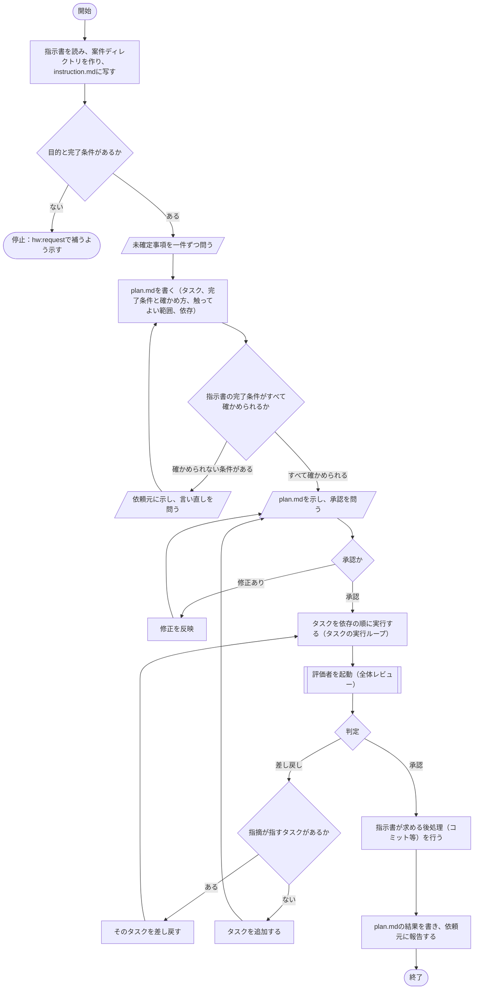
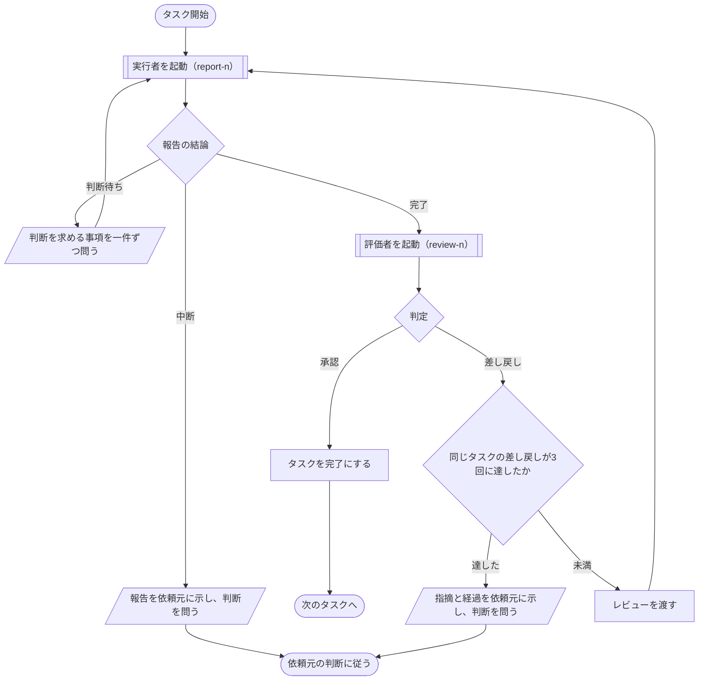

# hw:execute

`hw:request`が作成した指示書を受け、実行計画を立て、計画のタスクごとに実行者に実施させ、評価者のレビューを経て成果物を仕上げる。手順の定めは[SKILL.md](../../../plugin/skills/execute/SKILL.md)にあり、本書はその処理フローを図で示す。

## 手順の処理フロー

図の読み方：

- 平行四辺形は依頼元との対話（問いと答え、承認）である。答えは`plan.md`の裁定の節に記す
- 二重枠は担当（サブエージェント）の起動である。実行者は`hw:worker`、評価者は`hw:reviewer`で、起動のたびに新しい人物である
- いずれの問いでも、答えまたは承認が得られなければ、問いを示したまま停止する
- 統括が行ったこと（問いと答え、承認、担当の起動、報告の受領、判定、状態の変更）は、その都度`plan.md`の経過の節に記す

### 全体の流れ

### タスクの実行ループ

全体の流れの「タスクを依存の順に実行する」で、タスクごとに次を繰り返す。互いに依存せず、触ってよい範囲が重ならないタスクは同時に進めてよい。

