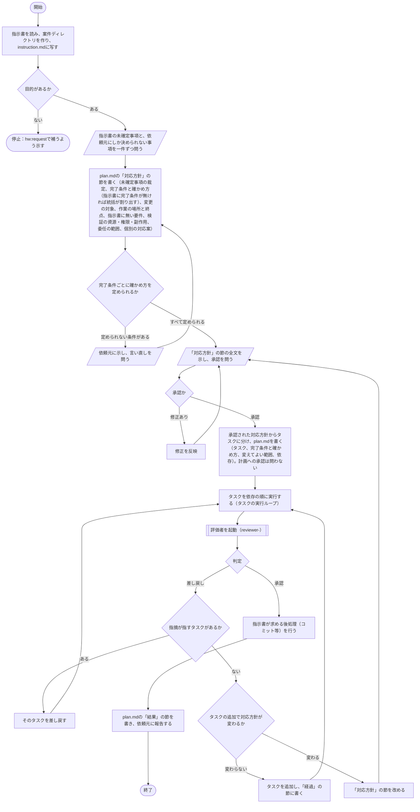

# hw:execute

指示書（`hw:request`が作成したもの、または`hw:request`以外の手段で書かれたもの）を受け、対応方針を立てて依頼元の承認を得たうえで、実行計画を立て、計画のタスクごとに実行者に実施させ、評価者のレビューを経て成果物を仕上げる。手順は[SKILL.md](../../../plugin/skills/execute/SKILL.md)に定めてあり、本書はその処理フローを図で示す。

## 手順の処理フロー

### 図の読み方

- 平行四辺形は、依頼元との対話（問いと答え、承認）を表す
- 二重枠は、担当（サブエージェント）を起動することを表す。実行者は`hw:worker`、評価者は`hw:reviewer`である

### 図とあわせて読む規則

- 依頼元との対話で得た答えは、`plan.md`の「裁定」の節に書く
- 担当は起動するたびに別の人物になる。統括（本スキルを実施する人物）は、作業に要るもの（作業、目的、完了条件、制約、変えてよい範囲、読む資料、記録の形、書き先、返答の形）をプロンプトに書いて渡す。担当は記録を書き先（`worker-<n>`、`reviewer-<n>`）に書き、返答は一行だけを返す。統括は返答を見て次に何をするかを決め、記録は要る節だけを、見出しを手がかりに抜き出して読む
- いずれの問いでも、答えまたは承認が得られなければ、問いを示したまま停止する
- 担当の起動に失敗したら、または返答のパスに記録が無ければ、失敗の内容（コマンドと応答）を示して停止する。統括が代わりに作業しない
- 統括が行ったこと（問いと答え、対応方針の承認、担当の起動、報告の受領、判定、状態の変更）は、その都度`plan.md`の「経過」の節に書く
- 指示書に完了条件が無くても停止しない。完了条件は統括が指示書から割り出し、統括が割り出したものと分かる形で「対応方針」の節に書き、依頼元が対応方針を承認するときに確かめる
- 変えてよいのは、指示書の制約の内で、計画の変えてよい範囲に書いた場所だけである。指示書の対象範囲や依頼元の意見は、対応方針で変更の対象を定めるときの材料である
- 計画については依頼元に承認を問わない。計画を変える（タスクの追加、削除、完了条件や範囲の変更）とき、対応方針も変わるなら、変えた対応方針を依頼元に示して承認を得る。対応方針が変わらなければ、変えた内容を「経過」の節に書いて進む

### 全体の流れ

### タスクの実行ループ

全体の流れの「タスクを依存の順に実行する」で、タスクごとに次を繰り返す。互いに依存せず、変えてよい範囲が重ならないタスクは同時に進めてよい。

