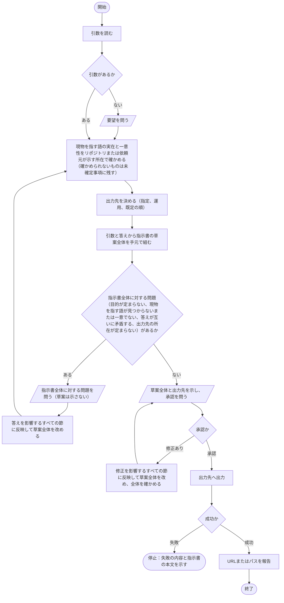

# hw:request

依頼元の要望を、引数と対話を通して言語化し、指示書として残す。手順の定めは[SKILL.md](../../../plugin/skills/request/SKILL.md)にあり、本書はその処理フローを図で示す。

## 手順の処理フロー

図の読み方：

- 平行四辺形は依頼元との対話（問いと答え）である。答えは、影響するすべての節に反映する
- どう対処するか（どのファイルにどういう修正を行うか、何がボトルネックか、対象範囲、完了条件）は、依頼元から言われない限り問わない。これらが無いことは、指示書全体に対する問題としない。目的は必ず定め、定まらなければ問う
- 問いの進め方は、[作業品質の基盤](../index.md#作業品質の基盤)の「問い方」に従う
- いずれの問いでも、答えまたは承認が得られなければ、問いを示したまま停止する。推測で補って進めない
- 問いに示すのは問題だけであり、草案は承認を問うときに一度だけ示す
- 問いは指示書全体を単位とし、節を一つずつ切り出して問わない。現物を指す語が見つからないまたは一意でない場合と、出力先の所在が定まらない場合も、その場では問わず、指示書全体に対する問題の一つとして問う
- 答えを受けて草案全体を改めたら、改めた草案全体について、現物を指す語の確認から問題の確認までを再び行う

