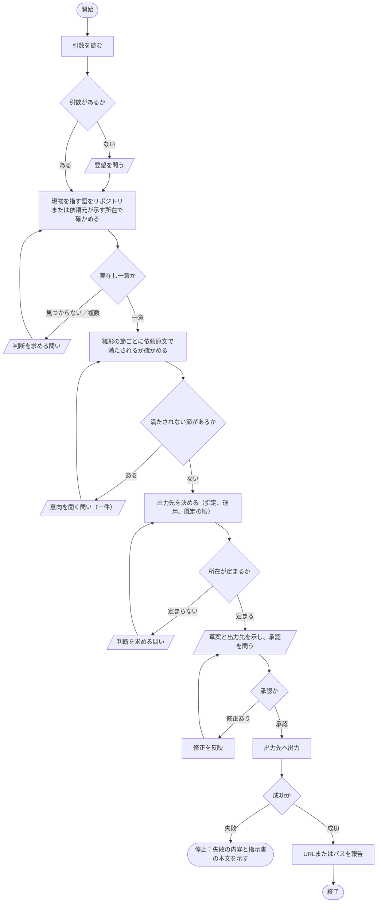
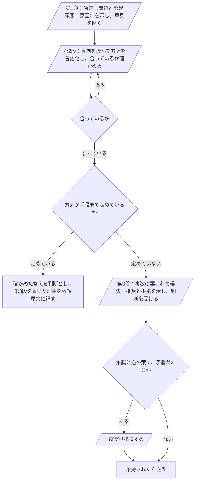

# hw:request

依頼元の要望を、引数と対話を通して言語化し、指示書として残す。手順の定めは[SKILL.md](../../../plugin/skills/request/SKILL.md)にあり、本書はその処理フローを図で示す。

## 手順の処理フロー

図の読み方：

- 平行四辺形は依頼元との対話（問いと答え）である。答えを得るたびに依頼原文へ追記してから次へ進む
- いずれの問いでも、答えまたは承認が得られなければ、問いを示したまま停止する。推測で補って進めない

### 判断を求める問い

図中の「判断を求める問い」は、三段の対話で進める。

