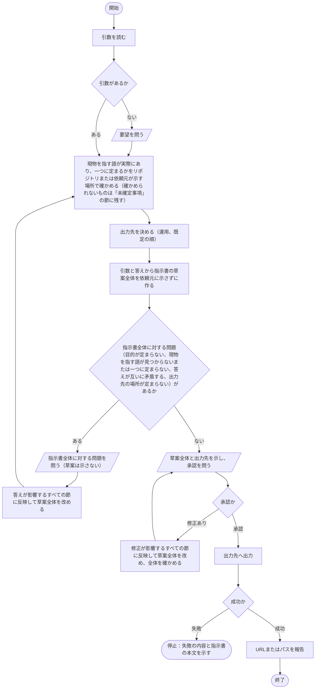

# hw:request

依頼元の要望を、引数（要望または相談）と対話を通して言語化し、指示書として残す。手順は[SKILL.md](../../../plugin/skills/request/SKILL.md)に定めてあり、本書はその入出力、設計の判断、処理フローを示す。

## 入出力

- **入力**：引数（要望または相談）、対話での答え、定められた規則のうち外部トラッカーの使用を定めた記述
- **出力**：指示書一件。雛形は`plugin/skills/request/templates/instruction.md`
- **出力先**：運用で定められた外部トラッカー、既定（`.hw/instructions/`）の順で決める

## 設計の判断

- 指示書の各節には依頼元が確かめた内容だけを書き、本スキルを実施する人物の解釈・提案・調査結果を、依頼元の確認を経ずに加えない。本スキルを実施する人物は対話の中で依頼元の意見を言語化し、要るなら対応案を示してよい。指示書は後続の作業（人またはAI）が目的を確かめるときに読むものであり、そこに本スキルを実施する人物の推論が混ざると、依頼と推論の区別がつかなくなるためである。引き出せなかったことは「未確定事項」の節に残す。
- どう対処するか（どのファイルにどういう修正を行うか、何がボトルネックか、対象範囲、完了条件。以下「四点」）は、依頼元から言われない限り問わず、四点が無いことを指示書全体に対する問題としない。目的（抽象化された目的）は必ず定め、定まらなければ問う。どう対処するかは対応方針であり、`hw:execute`が依頼元の承認を得て定めるためである。指示書は目安であり、どう対処するかを定めるものではない。
- 引数は要望に限らず、相談（実現したいことが要望の形で示されず、どうすればいいかを問う形の引数）でもよい。相談は、問いに対する依頼元の意見と同じに扱う。目的が定まらなければ、[作業品質の基盤](../index.md#作業品質の基盤)の「問い方」の手順に従い、依頼元の意見を言語化して確かめ、要るなら目的の候補を示し、定まるまで対話する。要望でも相談でも進め方を同じにするのは、相談専用の分岐を作らないためである。
- 依頼元から出た四点についての意見は、「依頼元の意見」の節に、依頼元の言葉をそのまま写すのではなく、正しく言語化した形で書く。「経緯と理由」の節には、当初の要望から目的に至った経緯と、依頼元の意見や目的の背景を書く。依頼元の意見と目的の背景を漏らさないためである。言語化した意見が依頼元の意見を正しく言い表しているかは、依頼元が草案全体を承認するときに確かめる。
- 本スキルが問いについて定めるのは、何を問うか（引数が無いときの要望、指示書全体に対する問題、草案全体と出力先の承認）と、問いの単位と、答えを、影響するすべての節に反映することだけであり、問いの進め方は[作業品質の基盤](../index.md#作業品質の基盤)の「問い方」に置く。問いは種類で分けない。いずれの問いも同じ進め方で問うためである。
- 問いは指示書全体を単位とする。草案全体を依頼元に示さずに作り、指示書全体に対する問題（目的が定まらない、現物を指す語が見つからないまたは一つに定まらない、答えが互いに矛盾する、出力先の場所が定まらない、のいずれか）を問い、節を一つずつ切り出して問わない。答えは影響するすべての節に反映して草案全体を改め、改めた全体を確かめ直す。承認も指示書全体に対して得る。節は互いに内容が関わっており、依頼元の答えは一つの節だけに影響するとは限らないためである。
- 問いに示すのは問題だけであり、草案は承認を問うときに一度だけ示す。一度に問う問題は依頼元が答えられる量に絞る。問いに草案を含めると情報が多くなり、依頼元が何に答えればよいかが分かりにくくなるためである。
- 外部トラッカーをどう使うかは運用が決めることであり、プラグインは何も提供しない。設定ファイルの形式も、トラッカーごとの課題の作り方も定めない。プラグインが決めるのは、運用が外部トラッカーを定めていれば既定より優先する、という順序だけである。
- 出力先が異なっても内容は同一の指示書とする。表題を課題の題名に、本文を課題の本文に充てるだけであり、出力先ごとに内容の形式を変えない。
- 出力は依頼元の承認を得てから行う。承認が得られなければ問いを示したまま停止し、推測で補って進めない。出力先を独断で変えない。

## 手順の処理フロー

### 図の読み方

- 平行四辺形は、依頼元との対話（問いと答え）を表す

### 図とあわせて読む規則

- 依頼元の答えは、影響するすべての節に反映する
- 引数は要望に限らず、相談（実現したいことが要望の形で示されず、どうすればいいかを問う形の引数）でもよい。相談は、問いに対する依頼元の意見と同じに扱い、進め方は要望と変わらない
- どう対処するか（どのファイルにどういう修正を行うか、何がボトルネックか、対象範囲、完了条件）は、依頼元から言われない限り問わない。これらが無いことは、指示書全体に対する問題としない。目的は必ず定め、定まらなければ、[作業品質の基盤](../index.md#作業品質の基盤)の「問い方」の手順に従い、依頼元の意見を言語化して確かめ、要るなら目的の候補を示し、定まるまで対話する
- 問いの進め方は、[作業品質の基盤](../index.md#作業品質の基盤)の「問い方」に従う
- いずれの問いでも、答えまたは承認が得られなければ、問いを示したまま停止する。推測で補って進めない
- 問いに示すのは問題だけであり、草案は承認を問うときに一度だけ示す
- 問いは指示書全体を単位とし、節を一つずつ切り出して問わない。現物を指す語が見つからないまたは一つに定まらない場合と、出力先の場所が定まらない場合も、その場では問わず、指示書全体に対する問題の一つとして問う
- 答えを受けて草案全体を改めたら、改めた草案全体について、現物を指す語を確かめるところから、指示書全体に対する問題があるかを確かめるところまでを再び行う

### 全体の流れ

