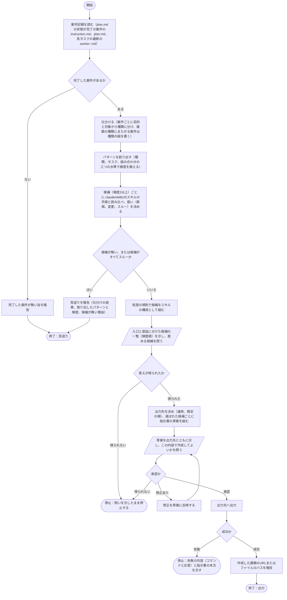

# hw:skillify

`hw:execute`の案件記録（`.hw/cases/`）を分析し、複数の案件に繰り返し現れるパターンを割り出し、依頼元が選んだものをプロジェクトのスキル（`.claude/skills/`に置くスキル）にするための指示書を作る。手順は[SKILL.md](../../../plugin/skills/skillify/SKILL.md)に定めてあり、本書はその入出力、設計の判断、処理フローを示す。

## 入出力

- **入力**：案件記録（`.hw/cases/`の案件のうち`plan.md`の状態が完了のものの、`instruction.md`、`plan.md`の「対応方針」の節と「タスク」の節、各タスクの最新の`worker-<n>.md`）、プロジェクトの既存スキル（`.claude/skills/*/SKILL.md`）、定められた規則のうち外部トラッカーの使用を定めた記述
- **出力**：候補1件につき指示書1通、またはスキルにするのを見送るという報告。指示書の目的は、新規ならパターンの手順を`.claude/skills/<name>/SKILL.md`として用意すること、変更なら既存のスキルに案件記録で繰り返された手順や条件分岐を加えることである。雛形は`hw:request`と共用する`plugin/skills/request/templates/instruction.md`。見送るという報告には、仕分けの結果（案件と種類）、割り出したパターンと頻度、候補が無い理由（頻度が2未満、または既存スキルで済む）を書く
- **出力先**：`hw:request`と同じ順（運用で定められた外部トラッカー、既定（`.hw/instructions/`））で決める

## 設計の判断

- 本スキルは指示書を作るまでを担い、スキルを作るのは`hw:execute`に任せる。分析することとスキルを作ることは別の仕事であり、スキルを作るのに要る承認と差し戻しの流れは`hw:execute`に既にあるためである。
- 分析の対象は完了した案件に限る。中止した案件の計画は、実際に最後まで行った手順ではないためである。
- 種類（案件の分類。何をどう変える案件か）は記録から割り出し、事前の一覧を持たない。一覧を先に定めると、どの種類にも分けられない案件が出るためである。
- パターン（複数の案件に繰り返し現れるもの）は、種類、タスク、組み合わせの三つの水準で割り出す。種類のパターンは、同じ種類の案件で対応方針とタスクの並びが揃うものである。タスクのパターンは、同じ行うことと成果物の形を持つタスクまたはその並びが、複数の案件に現れたものである。組み合わせのパターンは、複数の種類にまたがる案件が、同じ種類の組で複数あるものである。種類の水準を設けるのは、種類に固有の知識（変更の対象、確かめ方、検証の資源と権限）は「対応方針」の節にあり、タスクの並びだけでは種類に特化したスキルの材料にならないためである。組み合わせの水準は、種類のスキルを順に呼んで組み合わせる形に対応する。
- 粒度の規則で、候補をスキルの構成として組んでから示す。スキルが増えるほど使う側はどれを使えばよいか分からなくなり、起動のたびに全スキルの説明がコンテキストに並ぶコストも増えるためである。規則は次の四つである。
    - 種類のパターンは、種類ごとに一つのスキルにする。利用者が呼ぶスキル（入口）になる
    - タスクのパターンは、二つ以上の種類にまたがって現れるときだけ、他のスキルから呼ばれるスキル（部品）にする。一つの種類の中にしか現れないなら、その種類のスキルの手順の一つとして含める
    - 組み合わせのパターンは、その組み合わせ自体が複数の案件に現れるときだけ、種類のスキルを順に呼ぶだけで手順を持たないスキル（ラッパー）にする。ラッパーも入口である
    - 一覧は入口と部品に分けた構成として示し、スキルの総数と、既にある`.claude/skills/`のスキルの数を添える。依頼元が選ばなかった部品は、呼ぶ側のスキルの手順に含める
- 候補は頻度（パターンが現れた案件の数）が2以上のパターンとし、構成として示した一覧から依頼元が選ぶ。1件だけの手順は繰り返しではなく、何をプロジェクトのスキルにするかは依頼元が決めるためである。
- 候補1件につき指示書1通を作る。`hw:execute`の案件1件がスキル1つに対応し、承認と差し戻しが1つのスキルの範囲に収まるためである。スキル間の依存（部品なら呼ぶ側のスキル、種類のスキルとラッパーなら呼ぶスキルと、先にそのスキルが要ること）は指示書の「制約」の節に書く。
- 既存スキルと照らす対象は、プロジェクトの`.claude/skills/`だけとし、プラグインのスキルと利用者個人のスキルは対象にしない。作るスキルの置き場と照らす対象を同じ場所に揃え、プロジェクトの外のスキルをどうするかは、その所有者が決めることであるためである。照らした結果で、候補の扱いを新規（同じ手順を担うスキルが無い）、変更（同じ手順を担うスキルがあるが、案件記録にそのスキルに無い手順や条件分岐がある）、スルー（同じ手順を担うスキルがあり、差が無い。一覧には載せるが、指示書は作らない）に分ける。
- 作るスキルはこのプラグインに依存しない、という制約を指示書に書く。作るスキルは、プラグインのスキル、エージェント、フック、雛形、`.hw/`の記録を参照せず、単独で動く。プラグインは必ずしもチームで入れているとは限らず、個人で使っている場合に共有すると使えないスキルになるためである。
- 指示書の雛形は`hw:request`と共用する。`hw:execute`が受け取る指示書の形を一つに保つためである。
- 指示書には依頼元が承認した内容だけを書く。理由は`hw:request`と同じであり、指示書は後続の作業が目的を確かめるときに読むものであり、そこに本スキルを実施する人物の推論が混ざると依頼と推論の区別がつかなくなるためである。案件記録をもとに書いた手順の案は、依頼元が承認するときに確かめた内容として、指示書の「依頼元の意見」の節に書く。

## 手順の処理フロー

### 図の読み方

- 平行四辺形は、依頼元との対話（問いと答え、承認）を表す

### 用語

- パターンは複数の案件に繰り返し現れるものであり、次の三つの水準がある。タスクの並びは、一つの案件の`plan.md`のタスクを、行うことと成果物の形で順に並べたものである
    - 種類のパターン：同じ種類の案件が複数あり、対応方針（変更の対象、完了条件と確かめ方、検証の資源と権限）とタスクの並びが揃うもの
    - タスクのパターン：同じ行うことと同じ成果物の形を持つタスク、またはその並びが、複数の案件に現れたもの
    - 組み合わせのパターン：複数の種類にまたがる案件が、同じ種類の組で複数あるもの
- 種類は案件の分類であり、`instruction.md`の目的と対象から、何をどう変える案件かで分ける
- 頻度はパターンが現れた案件の数である
- 入口は利用者が呼ぶスキル（種類のスキルとラッパー）、部品は他のスキルから呼ばれるスキル、ラッパーは種類のスキルを順に呼ぶだけで手順を持たないスキルである

### 図とあわせて読む規則

- 読む案件記録は、`plan.md`の状態が完了の案件だけである。読むのは`instruction.md`（目的、依頼元の意見）、`plan.md`（「対応方針」の節の変更の対象、完了条件と確かめ方、検証の資源・権限・副作用、委任の範囲と、「タスク」の節の作業、成果物、完了条件）、各タスクの最新の`worker-<n>.md`（行った作業）である
- 種類の一覧は事前に持たず、記録から割り出す
- 候補は頻度が2以上のパターンである
- 粒度の規則は次の四つである
    - 種類のパターンは、種類ごとに一つのスキルにする。入口になる
    - タスクのパターンは、二つ以上の種類にまたがって現れるときだけ、部品にする。一つの種類の中にしか現れないなら、その種類のスキルの手順の一つとして含め、単独のスキルにしない
    - 組み合わせのパターンは、その組み合わせ自体が複数の案件に現れるときだけ、ラッパーにする
    - 一覧は構成として示す。入口と部品を分け、スキルの総数と、既にある`.claude/skills/`のスキルの数を添える。依頼元が選ばなかった部品は、呼ぶ側のスキルの手順に含める
- 既存スキルとして照らすのは、プロジェクトの`.claude/skills/*/SKILL.md`だけであり、プラグインのスキルと利用者個人のスキルは対象にしない。候補の扱いは次の三つである
    - 新規：同じ手順を担うスキルが無い
    - 変更：同じ手順を担うスキルがあるが、案件記録にそのスキルに無い手順や条件分岐がある
    - スルー：同じ手順を担うスキルがあり、差が無い。一覧には載せるが、指示書は作らない
- 問いの進め方は、[作業品質の基盤](../index.md#作業品質の基盤)の「問い方」に従う
- いずれの問いでも、答えまたは承認が得られなければ、問いを示したまま停止する。推測で補って進めない
- 出力先の外部トラッカーへの課題の作成手順は運用が定める。運用の記述に無い事項は依頼元に問う

### 全体の流れ

