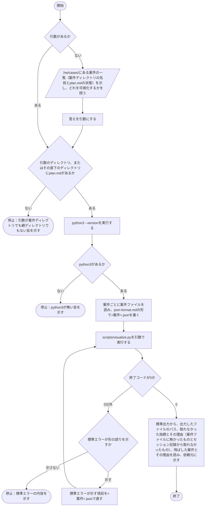

# hw:visualize

`hw:execute`の案件記録（`.hw/cases/<案件>/`）を一つ指定すると、案件ファイルから分析項目ごとの値を取り出して`<案件>.json`に書き、スクリプトでその案件で使った資源（トークン量、費用、所要時間、担当の起動回数）、進め方（タスクの分け方、差し戻し、裁定、時系列）、質（差し戻しの理由、提案、変更量）をHTMLに可視化し、案件一覧の`index.html`を作り直す。手順は[SKILL.md](../../../plugin/skills/visualize/SKILL.md)に定めてあり、本書はその入出力、設計の判断、処理フローを示す。

## 入出力

- **入力**：引数（案件ディレクトリのパス、または案件の親ディレクトリのパス。既定の置き場所は、案件ディレクトリが`.hw/cases/<案件>/`、親ディレクトリが`.hw/cases/`である。親ディレクトリなら、その直下の`plan.md`を持つ全案件を可視化する。引数のディレクトリに`plan.md`が無く、直下に`plan.md`を持つディレクトリが一つ以上あれば、親ディレクトリとして扱う）、案件ファイル（`plan.md`、`tasks/*/`の報告`worker-<n>.md`とレビュー`reviewer-<n>.md`、案件ディレクトリ直下の全体レビュー`reviewer-<n>.md`。古い案件では報告が`report-<n>.md`、レビューが`review-<n>.md`）、JSONの形（`plugin/skills/visualize/json-format.md`）、Claude Codeのセッション記録（設定ディレクトリ（`CLAUDE_CONFIG_DIR`、無ければ`~/.claude`）の下の`projects/`）、単価表（`plugin/skills/visualize/pricing.json`）。案件ファイルは本スキルを実施する人物（以下、実施者）が読み、セッション記録と単価表はスクリプトが読む
- **出力**：`.hw/analysis/`（利用者が`--out`で出力先を指定したときはその出力先）の下の、案件ごとの`<案件>.json`と`<案件>.html`、および案件一覧の`index.html`
    - `<案件>.json`：二つの部分からなる。一つは、実施者が案件ファイルから取り出して書く分析項目ごとの値（表題、状態、着手日時と完了日時、目的、段階、タスク、裁定、対応方針の変更の回数、経過、レビュー、報告、完了から実行中に戻した回数、判定が差し戻しの全体レビューごとの差し戻したタスク、利用者レビューの差し戻しごとの日時と差し戻したタスク、採り入れた提案の数、変更量、記録に無かった項目と理由）である。もう一つは、スクリプトが`script`の下に書き足す値（担当の起動（エージェントの種類、モデル、effortを含む）、起動回数、トークン量、費用、標準以外の呼び出しの数、所要時間（全体、AIの作業時間、待機時間と待機の区間、タスクごとの開始日時、完了日時、所要時間を含む）、作業ブランチ、統括の期間が重なる案件、並列か直列か、止まっていた区間（担当の起動が無く10分以上空いた区間）、取れなかった指標と理由）である。このうち担当の起動回数は実施者が書いた項目から数え、他はセッション記録と単価表から求める
    - `<案件>.html`：案件一覧へのリンク、表題と、次の節。概要（目的）。基本情報（状態、着手日時、完了日時、所要時間（全体、AI、待機）、セッションID、作業ブランチの三列の表。所要時間の行は「所要時間」の見出しを三行に結合し、「全体」「AI」「待機」の見出しと値を並べる。ほかの行は見出しを二列に結合する）。費用（合計のトークン量と合計の費用（米ドル）の大きなカード、担当（統括、実行者、評価者）ごとの費用、トークン量の合計、使ったモデルの小さなカード、トークン量と費用を担当ごと、モデルごと、タスクごとに示す棒グラフ、単価の日付と出所、費用の求め方、標準以外の呼び出しの数等の注記）。処理（全体、AI、待機の所要時間の大きなカード（待機には待機の区間の件数を添える）、担当の起動回数（実行者、評価者、全体レビュー）と並列か直列かの小さなカード、着手からの段階、タスクごとの担当の起動、全体レビュー、利用者レビュー、裁定の時点、待機の区間を示す図、図の範囲と図に描けなかったものの注記、止まっていた区間の箇条書き、段階とタスクの流れを示すフローチャート（凡例と、図に置けなかったものの注記）、経過（初期状態は閉じている））。タスク一覧（初期状態は閉じている。タスクごとの概要と、横に並べた「タスク」の見出しの二列の表（状態、開始日時、完了日時、所要時間（トータル）、所要時間（AI）、所要時間（待機時間）、差戻回数、依存）と「担当」の見出しの担当の起動ごとの二列の表（役割、agent、model、effort）。担当の表は評価者の起動の後に来る実行者の起動ごとに始まる組に分け、組を縦に並べ、2組目からは組の上に「差戻1」「差戻2」…の見出しを置き、組の中の表を横に並べる。画面の幅が足りなければ折り返して縦に並ぶ。その下に、成果物と変えてよい範囲の箇条書き）。レビューと差し戻し（初期状態は閉じている。差し戻しの回数と理由、全体レビューの回数、完了から実行中に戻した回数、対応方針の変更の回数、裁定、評価者の提案と採り入れた数、変更量、取れなかった指標とその理由）
    - `index.html`：出力先に`<案件>.json`がある全案件の一覧の表と、「指標の比較」（初期状態は閉じている）。一覧の表の先頭の列は、1から並ぶ番号である。一覧の表の表題は、その案件の`<案件>.html`へのリンクである。「指標の比較」には、指標ごとに案件を並べた棒グラフと、案件ごとの変更量（ファイル数、追加行数、削除行数）の箇条書きがある。棒グラフの案件名は、その案件の`<案件>.html`へのリンクである
- **スクリプト**：`plugin/skills/visualize/scripts/`。`visualize.py`が入口であり、`<案件>.json`の形を確かめる`json_format.py`、セッション記録を読む`session_log.py`、`script`の下の値を組み立てる`metrics.py`、HTMLを生成する`render.py`からなる。案件ファイルは読まず、セッション記録には書き込まない。`<案件>.json`に書き込むのは`script`の下だけである

## 設計の判断

- 案件ファイルの読み取りは実施者が行い、スキルに同梱するPython 3のスクリプト（標準ライブラリだけを使う）は、`<案件>.json`の形の確かめ、セッション記録の集計、HTMLの描画だけを行う。実施者はHTMLを自分で書かない。案件記録の形は、プラグインのバージョンアップ等で変わるためである。分析項目に対して案件ファイルから要る情報を取り出すことが本スキルの役割であり、形の違いは実施者が吸収する。これにより、スクリプトは案件ファイルの形を知らずに済む。一方、セッション記録は大きく（数百ファイル、百MBを超える）、実施者が読んで数えるのに向かないため、スクリプトが集計する。スクリプトなら、同じセッション記録から同じ値が出て、案件が増えても費用が増えない。`python3`が無い環境では停止する。
- 出力先は`.hw/analysis/`とし、案件ごとの`<案件>.json`と`<案件>.html`、案件一覧の`index.html`を置く。可視化は案件を分析するために行うためである。
- `<案件>.json`は、実施者が書く部分とスクリプトが書き足す部分（`script`の下）を一つのJSONに置き、その形を`json-format.md`に定めて、スクリプトが実行のたびに確かめる。形に合わなければ、誤りのある項目の場所と内容を標準エラーに示し、その案件のHTMLを作らない。実施者は示された項目を直して再び実行する。実施者とスクリプトの受け渡しの形を一つに定め、形に合わないJSONを早く見つけるためである。スクリプトは実施者が書いた部分を変えず、`script`の下だけを実行のたびに書き直す。`index.html`の一覧と比較は、出力先にある`<案件>.json`から作る。統括の期間が重なる案件を示すための他の案件の着手日時と完了日時も、出力先の他の`<案件>.json`から取る。これにより、一つの案件を可視化するたびに、他の案件の記録を読み直さずに済む。
- トークン量と所要時間は、Claude Codeのセッション記録（`<設定ディレクトリ>/projects/<プロジェクトディレクトリの絶対パスの英数字以外を-に置き換えたもの>/`）から取る。案件とセッションの結び付けには、主会話の`Agent`ツールの呼び出しのプロンプトに、`hw:execute`が渡す書き先（`.hw/cases/<案件>/`の下の担当の記録のパス。タスクの記録は`tasks/<タスク>/worker-<n>.md`等、全体レビューは`reviewer-<n>.md`。古い案件では`report-<n>.md`、`review-<n>.md`）が含まれることを使う。書き先は、プロンプトに「書き先」の見出しがあればその下の最初のパス、見出しが無ければ最初の「書き先」の語の後の最初のパス、どちらも無ければプロンプトの最後のパスとする。見出しを先に見るのは、プロンプトの本文（用語の説明や資料の説明）に「書き先」の語が見出しより前に現れることがあり、語だけを見るとその後のパスを書き先と取り違えるためである。見出しが無いときに語も見るのは、統括が書き先を箇条書きの項目名として書くことがあり、見出しだけを見ると、書き先の後に続く読む資料のパスを書き先と取り違えるためである。書き先に`.hw/cases/<案件>/`があればその案件に、無ければ（統括が`tasks/<タスク>/worker-<n>.md`のような相対パスで書いたとき）タスクの記録のディレクトリが`record_dir`と一致する案件（ディレクトリが無ければ全体レビュー）に結び付け、どちらも呼び出しの時刻が案件の期間（次の判断を参照）の内にあるものだけを結び付ける。相対パスの書き先も結び付けるのは、書き先の書き方で担当の起動回数、トークン量、費用が実際より少なくならないようにするためである。担当の起動の数は、セッション記録ではなく案件記録（報告とレビューの数）から数える。担当の起動は必ず記録を一つ残すので、記録の数が起動の数の現物である。セッション記録から結び付いた起動は記録と一つずつ突き合わせ、結び付かなかった記録と、記録に無い起動を一覧で取れなかった指標に載せる。これにより、トークン量や費用が実際より少ないことと、書き先の読み違いで別のタスクや役割に数えたことが、読む人に分かる。起動の`subagent_type`（`hw:worker`、`hw:reviewer`）と書き先から読んだ役割が合わない起動も載せる。担当の種類は起動の数の根拠にはしないが、読み違いの手がかりになるためである。書き直されたセッション記録には同じ呼び出しが二度現れることがあるため、同じ`tool_use_id`の呼び出しは最初の一件だけを数える。着手日時が記録に無ければ、期間の条件を使わずに書き先のパスだけで結び付け、その旨を取れなかった指標に載せる。担当の起動とタスクは、書き先のタスクの記録のディレクトリと、実施者が`<案件>.json`のタスクに書いた記録のディレクトリ（`record_dir`）で結び付ける。案件記録にはトークン量が無く、セッション記録にはモデル呼び出しごとの`usage`があるためである。書き先のパスは`hw:execute`が必ず渡すので、記録を変えずに結び付けられ、複数のセッションにまたがる案件も結び付く。プロンプトのすべてのパスではなく書き先のパスだけを使うのは、担当のプロンプトには、読む資料として他の案件の記録のパスが含まれることがあるためである。期間も使うのは、書き先の判定が誤って他の案件や後の作業（その案件の記録を読む別の案件）の担当の起動を拾ったときに、案件の期間の外の起動を除くためである。
- 記録を数えるかの判定（担当の起動の結び付け、統括のトークン量、作業ブランチ、統括の期間が重なる案件の判定）には、案件の期間を使う。案件の期間は、着手日時から、完了日時の秒の終わり（完了日時に1秒を足した時刻の手前）までとし、完了日時が無ければ可視化した日時までとする。時間の長さ（案件全体の所要時間、所要時間の全体、待機の区間の切り取り、AIの作業時間、止まっていた区間）は、案件の期間ではなく、着手日時から完了日時までで測る。案件記録の着手日時と完了日時は秒までで書かれ、セッション記録の時刻は秒未満まであるためである。記録を数えるかを完了日時ちょうどまでで判定すると、完了日時と同じ秒の中の記録（例えば完了日時18:05:41に対して18:05:41.062の記録）が外れるので、記録を外さないように秒の終わりまで含める。一方、長さは、基本情報に載せる完了日時と合うように、完了日時までで測る。待機の区間を切る範囲も全体と同じにするのは、範囲が違うと待機の区間が全体の外の時間を含み、AIの作業時間（全体から待機時間を引いたもの）が少なく出るためである。完了日時が無ければ、案件全体の所要時間は「不明」とし、案件全体の所要時間を除く時間の長さは着手日時から可視化した日時までで測る。着手日時が無ければ、止まっていた区間は、開始時刻と終了時刻がある担当の起動のうち最初のものの開始から求める。
- 統括のトークン量は、案件に結び付くセッション（結び付いた担当の起動があるセッション）の主会話の記録のうち、案件の期間の内にあるモデル呼び出しを数える。主会話の`assistant`記録を`message.id`ごとに最後の記録にまとめてから（次の判断を参照）、期間で絞って合計する。期間で絞ってからまとめると、期間の境界をまたぐ一つの応答の扱いが変わり、独立に確かめた人と値が合わなくなるためである。同じセッションで期間が重なる案件があれば、どちらの案件にも数え、重なる案件を示す。統括の呼び出しには案件を示す印が無く、期間で切り出すしかないためである。呼び出しごとに案件を当てる仕組みを入れるより、重なりを示す方が単純である。着手日時が記録に無ければ期間を定められないため、統括のトークン量を「不明」と載せる。案件に結び付いた担当の起動が一件も無ければ、統括のトークン量を数えず、「不明」と載せる。数えるセッションを案件に結び付くセッションに限るのは、主会話の記録を期間だけで数えると、同じ期間に行った別の作業のセッションの記録も数えてしまうためである。
- 同じ`message.id`を持つ複数の記録は、一つの応答のストリーミングの途中経過が重なって書かれたものであり、最後の記録（出力トークンが最大のもの）の`usage`が応答全体の値である。そのため、`message.id`ごとに最後の記録を採る（出力トークンが同じなら後に書かれた記録を採る）。最初の記録を採ると、出力トークンを大きく少なく数える（実測で約14倍の差があった）ためである。
- 費用は、スキルに同梱する単価表（`pricing.json`）から求める。単価表には、モデルごとの入力、出力、キャッシュ作成（5分と1時間）、キャッシュ読み取りの100万トークンあたりの米ドルと、単価を写した日付と出所を持たせる。単価表に無いモデルの費用は「不明」と示す。単価はセッション記録に無く、時期で変わるためである。単価表に日付と出所を持たせ、利用者が書き換えられるようにする。
- 担当（統括、実行者、評価者）ごとの費用とタスクごとの費用は、単価表にあるモデルの費用の和とし、単価表に無いモデルを含むときは値に「（不明のモデルを除く）」を添える。モデルごとの費用は、単価表に無いモデルについて「不明」と示す。`index.html`の案件の費用の扱い（単価表にあるモデルの費用の和を示し、単価表に無いモデルを含むときはその旨を添える）にそろえるためである。
- 単価表は標準の単価（`service_tier`と`speed`が`standard`）だけを持ち、Batch API、`inference_geo`、Fast mode等の単価の違いは持たない。スクリプトは、標準以外の呼び出しの数を`service_tier`と`speed`の値ごとに数えてHTMLに示し、費用は標準の単価で求めた値であることを示す。標準以外の単価は条件ごとに異なり、単価表を複雑にするわりに、本リポジトリの記録では標準以外の呼び出しが無いためである。数を示せば、利用者が費用のずれの有無を判断できる。
- 進め方と質の指標は、実施者が分析項目ごとに案件ファイルから値を取り出す。記録の形が雛形と違っても（欄の名前が違う、裁定が番号付きの項で書かれている等）、同じ情報が記録にあれば取り出す。記録に無い項目だけを、値を`null`にして（null可の項目に限る）「不明」とし、理由（どの節を探して無かったか）を添える。採り入れた提案の数と変更量には、根拠（どの節のどの記述から読み取ったか）を書く。変更量のファイル数は、本文に数として書かれていなくても、「結果」の節等の成果物の一覧から数えてよく、そのときは数えたことと数え方を根拠に書く。定型や雛形に頼ると、記録の形が変わるたびに値が取れなくなるためである。根拠を書くのは、実施者の読み取りの揺れを、評価者と依頼元が確かめられるようにするためである。
- 既存の案件記録（古い形の記録）も、実施者が読んで値を出す。「不明」にするのは、記録に情報が無いときだけである。形が古いことは、情報が無いことではないためである。
- 変更量のファイル数、追加行数、削除行数は、それぞれ独立に`null`にでき、HTMLには記録にある部分だけを値で載せ、`null`の部分を「不明」と載せる。古い記録にはファイル数だけがあることが多く、変更量全体を「不明」にすると、比べられる情報を捨てることになるためである。三つとも記録に無ければ、`change`全体を`null`にし、三つとも`null`の`change`は形の確かめで誤りにする。変更量が記録に無いことを一つの形で書くためである。
- タスクごとの差し戻し回数は、タスクのレビューの判定が差し戻しの数、全体レビューの差し戻しでそのタスクが差し戻された数、利用者レビューの差し戻しでそのタスクが差し戻された数の和とし、HTMLの「レビューと差し戻し」の節に内訳と合計を、「タスク一覧」の節の「差戻回数」に合計を示す。実際にタスクを差し戻した回だけを数え、差し戻さずにタスクを追加して対処した回等は数えない。そのために、実施者は判定が差し戻しの全体レビューごとに差し戻したタスクを`overall_sendbacks`に、利用者レビューの差し戻しごとに日時と差し戻したタスクを`user_sendbacks`に書く。完了したタスクを差し戻す定めがあった版の`hw:execute`は、全体レビューと利用者レビューの差し戻しでも、指摘または差し戻しの内容が指すタスクを差し戻して実行者を再び起動していた。その版で作られた記録では、タスクのレビューの判定だけを数えると、記録でそのタスクが差し戻された回より少なく載る。三つの和で数えるのは、その版で作られた記録を数えるためである。今の`hw:execute`は、全体レビューと利用者レビューの差し戻しでは指摘または差し戻しの内容ごとにタスクを追加し、完了したタスクは差し戻さない（手順6と7）。そのため、今の`hw:execute`で作られた記録では、全体レビューの差し戻しと利用者レビューの差し戻しでタスクが差し戻された数は0になる。三つの和で数えることは依頼元が決めた。実際にタスクを差し戻した回だけを数え、差し戻さずにタスクを追加して対処した回等は数えないことは、依頼元のその決定の内で統括が決めた。
- 利用者レビューの段階が無い版の`hw:execute`で作られた記録では、完了にした後に依頼元の指示で案件を実行中に戻した回を、利用者レビューの差し戻し（`user_sendbacks`）として書く（`json-format.md`に定める）。その版では、依頼元が成果物を確かめて差し戻す行為が「完了にした後に実行中に戻す」形で記録されており、今の利用者レビューの差し戻しと同じ行為であるためである。同じ行為を同じ項目に書くことで、版の違う案件を同じ指標で比べられる。この扱いは依頼元が認めた。
- `overall_sendbacks`と`user_sendbacks`は必須の項目とし、無ければ形の確かめで誤りにして、その案件のHTMLを作らない。完了したタスクを差し戻す定めがあった版の`hw:execute`で作られた記録では、実施者が書き忘れると、タスクごとの差し戻し回数がタスクのレビューの判定だけで数えられ、少なく載るためである。必須にすることで、書き忘れを形の確かめで見つけられる。今の`hw:execute`で作られた記録では、二つの項目の要素の差し戻したタスク（`tasks`）は常に空になるが、それでも必須にする。記録がどの版の`hw:execute`で作られたかを区別せず、一つの形で確かめるためである。今の版で作られた記録では、要素の`tasks`に空の配列（`[]`）を書き、差し戻しが一つも無ければ項目そのものを空の配列にする。
- HTMLは外部の資源（スクリプト、CSS、フォント）を読み込まず、CSSとSVGの図を埋め込んだ一つのファイルにする。利用者の環境で開くたびに外部へ通信しないためである。トークン量や費用は利用者の環境の情報であり、外に出さない。
- `<案件>.html`は、案件一覧へのリンク、表題、概要、基本情報、費用、処理、タスク一覧、レビューと差し戻しの順に節を置く。表は基本情報の節（状態、着手日時、完了日時、所要時間、セッションID、作業ブランチ）の三列の表と、タスク一覧の節のタスクごとと担当の起動ごとの二列の表だけとし、費用と処理の主な数はカードで、費用の内訳は数値を棒の横に添えた棒グラフで、処理の時系列は図で、その他は箇条書きで示す。依頼元が、表にしすぎると案件を一目で把握できないと指摘したためである。基本情報の表の形（所要時間の全体、AI、待機を別の行にし、「所要時間」の見出しを三行に結合し、ほかの行の見出しを二列に結合すること）と、タスク一覧の節の形（初期状態を閉じること、タスクごとの見出しの下に字下げした概要、その下に横に並べた「タスク」の見出しの表と「担当」の見出しの担当の起動ごとの表、担当の表を差し戻しごとの組に分けて組を縦に並べ、初回の組には見出しを付けず、2組目からは「差戻1」「差戻2」…の見出しを付け、組の中の表を横に並べること、画面の幅が足りなければ折り返して縦に並ぶこと、表の行、依存をタスクの表に入れること、表の下に成果物と変えてよい範囲を載せること）は、依頼元が示した。組は、担当の起動を時刻の順に並べ、評価者の起動の後に来る実行者の起動ごとに始める。評価者の起動の前に続く実行者の起動は同じ組に入れ、最初の実行者の起動より前の評価者の起動は初回の組に入れる。判断待ちの後に実行者を起動し直したときのように、差し戻しが無くても実行者の起動が続くことがあり、実行者の起動ごとに組を始めると、差し戻しが無いのに「差戻<n>」の見出しが付くためである。差し戻しの回数と理由、全体レビューの回数、完了から実行中に戻した回数、裁定、評価者の提案と採り入れた数、変更量、取れなかった指標は、指示書の可視化の対象なので消さず、「レビューと差し戻し」の節にまとめて初期状態を閉じておく。
- 処理の時系列の図は、案件の着手日時から完了日時（無ければ可視化した日時）までを描き、対応方針の作成と計画を含む段階、タスクごとの実行者と評価者の起動、全体レビュー、利用者レビューを行にする。行をまとまり（方針と計画、タスクの実行、全体レビュー、利用者レビュー）に分け、まとまりの間に区切り線を引く。裁定の時点と待機の区間も図に描く。可視化の対象はタスクだけでなく、案件の着手からであると依頼元が示したためである。
- 処理の節には、時系列の図の他に、段階とタスクの流れを示すフローチャートを、止まっていた区間の箇条書きの後、閉じた経過の前に置く。依頼元が、時系列の図にしている項目（段階、タスクごとの実行者と評価者、全体レビュー、利用者レビュー）をフローチャートでも示し、「経過」の前に置き、タスク間の依存も直観的に分かるようにすることを求めたためである。時系列の図は、依頼元が無くすとは述べていないため残す。
    - フローチャートは、スクリプトがインラインのSVGで描く。HTMLは外部の資源を読み込まないため、mermaid等の描画のスクリプトを使えない。色は時系列の図と同じくCSS変数で指定し、明暗の両テーマで読めるようにする。狭い画面では、他の図と同じく縮めて横にはみ出さないようにする。
    - ノードは、`phases`の区間（開始日時のあるもの）とタスクである。ノードの種類（段階、タスク、全体レビュー、利用者レビュー）を枠の色と角の丸みで分け、凡例に載せる。タスクのノードは角を小さく丸め、他のノードは角を大きく丸める。段階のノードには区間と差し戻しの印を、タスクのノードには担当の起動回数と差し戻し回数を添える。同じ名前の段階には何回目かを添える。
    - 並べ方は上から下へ時間の順とする。段階は開始日時の順に一つずつ一行に置く。タスクは、着手した時刻（担当の最初の起動の開始時刻。起動が無ければ`tasks`の順で前のタスクの時刻）以後に始まった最初の全体レビューか利用者レビューの段階の直前にまとめて置く。まとまりの中では、依存の段（依存の無いタスクを0、依存するタスクを依存先の段の最大に1を足した段）ごとに一行にし、同じ段のタスクを着手の順に横に並べる。依存の無いタスクどうしが横に並ぶので、並列に進んだことが分かる。全体レビューや利用者レビューで差し戻した後に加えたタスクは、そのレビューより後に着手しているので、そのレビューの後ろに来る。上から下へとしたのは、段階が多い案件（全体レビューが8回等）でも横にはみ出さず、ノードの文字を読める大きさで描けるためである。タスクの置き場所の区切りを全体レビューと利用者レビューの段階だけにしたのは、案件記録の段階の時刻と担当の起動の時刻が前後することがある（計画の段階の始めが、最初のタスクの着手より後に記録されている等）ためである。
    - 矢印は三種類とし、線の色と形で見分け、凡例に載せる。流れ（灰色の実線）は、並べた順に、段階から次の段階へ、段階からタスクのまとまりの中で依存先の無いタスクへ、まとまりの中で依存されないタスクから次の段階へ引く。依存（青緑の破線）は、`depends`の依存ごとに、依存先から依存するタスクへ引く。差し戻しで戻った流れ（赤の実線）は、差し戻したレビューの段階から、差し戻したタスクと、そのレビューの後ろで次のレビューの段階までに置いたタスクへ引き、どちらも無ければ次のノードへ引く。全体レビューの差し戻しは、n回目の全体レビューの段階から引く。利用者レビューの差し戻しは、差し戻した日時までに終わった全体レビューか利用者レビューの段階のうち、最後に終わったものから引く。利用者レビューの段階が無い版の記録では、差し戻した日時の前に終わった全体レビューの段階から引くことになるので、そのノードに「利用者が差戻」と添えて、全体レビューの差し戻しと区別する。
    - 矢印の横の線は行の間に、縦の線はノードの列の間か右端に引き、ノードの上を通さない。行の間と列の間では、範囲が重なる線をずらして重ねない。矢印がノードの文字を隠さず、どの線がどのノードをつなぐかを追えるようにするためである。
    - 一番左の列のノードの左端より左には、矢印の線を引かない。ノードを迂回する縦の線は、両端のノードの中心から近い列の間か右端に引く。列の間と右端の幅は、そこに引く縦の線を一定の間隔で並べ、ノードの枠との間を空けられる幅に広げ、右の列のノードを右にずらす。図の左端とノードの間には線を引かないので、余白を狭くする。依頼元が、一番左のノードのさらに左に矢印を通すのをやめ、ノードを迂回するためならノードを右にずらすよう指摘したためである。
    - 矢印が出る位置と入る位置は、行の間ごと、列ごとに、上のノードから出る線と下のノードに入る線を合わせて、向かう先の横の位置の順にノードの幅に等間隔に置く。上のノードから真下のノードへ向かう矢印は、出る位置と入る位置を同じにしてまっすぐ引く。出る位置と入る位置を別々に決めると、別の矢印の縦の線が同じ横の位置に来て、縦の範囲が重なることがあるためである。
    - 矢印が向きを変える点（折れ目）がある行の間は、ノードの枠と横の線との間と、横の線どうしの間を、他の行の間より広く取る。折れ目の無い行の間（まっすぐな矢印だけが通る行の間、列の間を縦に通るだけの矢印がある行の間、矢印の無い行の間）は広げない。依頼元が、曲がった矢印がある所が窮屈に見えると指摘し、まっすぐな矢印しか無い行の間は今の間隔のままでよいとしたためである。広げる行の間を折れ目のある行の間に限ることは、窮屈に見えるのが折れ目の所であるため、依頼元の指摘の内で統括が決めた。図は広げる必要のある所だけ長くなる。
    - 開始日時の無い段階、`depends`が`null`のタスクの依存、元か先が図に無い差し戻しは、図の下の注記の「図に置けなかったもの」に載せる。時系列の図の「図に描けなかったもの」と同じく、図に無いものを読み手に示すためである。
- 段階（`phases`）は、実施者が「経過」と「裁定」の節から読み取って`<案件>.json`に書き、タスクの実行の区間は、スクリプトが担当の起動から求める。対応方針の作成と計画は、スクリプトがセッション記録から区別できず、案件ファイルの「経過」と「裁定」の日時から読み取るしかないためである。タスクの実行は、担当の起動ごとの開始と終了の時刻がセッション記録にあるため、スクリプトが求める。段階を一つも読み取れなければ、実施者は`phases`を`[]`にし、`unknown`に理由を書く。
- 段階をどのまとまりに置くかは、段階の名前で決める。名前に「利用者レビュー」を含む段階は利用者レビュー、「全体レビュー」を含む段階は全体レビュー、それ以外は方針と計画のまとまりに置き、同じ名前の段階を同じ行に描く。`phases`の要素を`name`、`start`、`end`の三つだけにして、形を単純に保つためである。まとまりを書く項目を加えない代わりに、実施者は`json-format.md`の「段階」の節に挙げた名前で段階を書く。
- 待機時間は、依頼元の回答を待っていた時間であり、案件に結び付くセッションの主会話の記録から求める。依頼元の発言（ツールの結果、自動の通知、コマンドの出力等を除く利用者の発言。条件は`json-format.md`に定める）ごとに、その前の依頼元の発言より後にある統括の最後の応答の時刻から、その発言の時刻までを待機の区間とし、着手日時から完了日時まで（完了日時が無ければ可視化した日時まで）で切って長さを合計する。セッション記録には依頼元に問うた時点の印が無く、統括の応答と依頼元の発言の時刻の間を待機と見るしかないためである。依頼元の発言から除く書き出しは、実際のセッション記録（40件）の`user`の記録を分類して決めた。セッションが複数あれば、重なる区間を一つにまとめてから合計する。同じ時間を二度数えると、待機時間が全体を超えることがあるためである。AIの作業時間は、全体（着手日時から完了日時まで。完了日時が無ければ可視化した日時まで）から待機時間を引いたものとする。結び付いた担当の起動が無いとき、または着手日時が無いときは、待機時間とAIの作業時間を「不明」と載せる。この求め方には次の限界がある
    - 統括の最後の応答の後に依頼元の発言が無ければ、その後の時間を待機に数えない。未完了の案件で、結び付くセッションが先に終わっていれば、可視化した日時までの残りの時間はすべてAIの作業時間になる
    - 統括がツールを実行している途中に依頼元が中断して発言すると、そのツールを実行していた時間も待機に数える
    - セッションが複数あるとき、あるセッションが待機していて別のセッションが作業していた時間も、待機に数える
- タスクの依存は、処理の節のフローチャートの依存の矢印と、タスク一覧の節の「タスク」の表の「依存」の行で示す。表の値は、依存するタスクがあれば「T1、T2」の形、依存するタスクが無ければ（`depends`が`[]`）「なし」、依存が不明（`depends`が`null`）なら「不明（理由：<理由>）」とする。依頼元は、一度は依存の図を不要とし、依存をタスクの表に入れると指定したので、依存の図を無くして表の行で示した。その後、依頼元が処理の節にフローチャートを加え、タスク間の依存も直観的に分かるようにすることを求めたため、依存はフローチャートの矢印で示すことにした。表の「依存」の行は残す。「なし」と「不明」の出し方は、依頼元の指定の内で統括が決めた。
- タスク一覧の節の担当の表のagent、model、effortは、スクリプトがセッション記録から取る。agentは、主会話の`Agent`の呼び出しの`subagent_type`とし、無ければサブエージェントの記録のディレクトリ（セッション記録のディレクトリの下の`<セッションID>/subagents/`）の`agent-<エージェントID>.meta.json`の`agentType`とする。modelは、`Agent`の呼び出しの結果の`resolvedModel`とし、無ければサブエージェントの記録（同じディレクトリの`agent-<エージェントID>.jsonl`）の`assistant`記録の`message.model`とする。effortは、サブエージェントの記録の`assistant`記録の最上位の`effort`とし、値が複数あれば並べる。案件記録にはこれらの値が無く、セッション記録には担当の起動ごとの値があるためである。取れなければ「不明」とその理由を載せる。
- タスクの開始日時は、そのタスクに結び付いた担当の最初の起動の開始時刻とし、完了日時は最後の起動の終了時刻とする。どちらも秒未満を切り捨て、所要時間（トータル）はその差とする。表に載る二つの日時の差と所要時間（トータル）が食い違わないようにするためである。所要時間（待機時間）は、タスクの開始日時から完了日時までの区間と、案件の待機の区間（上の待機時間の判断で求めたもの）が重なる時間の合計とし、所要時間（AI）は所要時間（トータル）から待機時間を引いたものとする。待機の区間は案件の主会話の記録から求めており、どのタスクについての待機かを示す印が無いため、時間の重なりでタスクに当てる。そのため、並列に進んだタスクでは、同じ待機の区間をそれぞれのタスクの待機時間に数える。
- 費用の節は、合計のトークン量と合計の費用（米ドル）を大きなカードで示し、担当（統括、実行者、評価者）ごとの費用とトークン量の合計を小さなカードで並べ、棒グラフをその下に置く。処理の節は、全体、AI、待機の所要時間を大きなカードで示し、担当の起動回数（実行者、評価者、全体レビュー）と並列か直列かを小さなカードで並べ、図をその下に置く。文で示していた値（担当ごとの使ったモデル、待機の区間の件数と合計、担当の起動回数、並列か直列か、止まっていた区間、レビューと差し戻しの節の回数、提案の数、変更量）は、カードか箇条書きの項目に移し、文は概要と補足の注記（単価の日付と出所、費用の求め方、標準以外の呼び出しの数、費用が分からないモデルの扱い、図の範囲等）だけに使う。依頼元が、費用と時間の主な数を一目で読めるようにカードの配置で目立たせ、概要や補足以外では文をなるべく使わないよう指摘したためである。カードは画面の幅に合わせて折り返して並べ、狭い画面で横にはみ出さないようにする。
- タスクの成果物と変えてよい範囲は、タスク一覧の各タスクの末尾（「タスク」と「担当」の表の下）に箇条書きで載せ、処理の節には載せない。依頼元が、処理の節の閉じた一覧から各タスクの末尾に移すと指定したためである。
- 作業ブランチは、案件に結び付くセッションの主会話の記録のうち、時刻が案件の期間の内にある記録の`gitBranch`から取り、最初に現れた順に重ねずに並べる。`HEAD`と空の文字列はブランチの名前ではないので除く。案件ファイルには作業ブランチを書く定型が無く、セッション記録は統括が実際に作業したブランチを記録ごとに持つためである。
- `hw:execute`の手順7に、次の三つを定型で書く定めを加えた。依頼元が差し戻すときに採り入れると決めた提案は、「裁定」の節に一件ずつ「`採り入れる提案: <レビューの相対パス> <番号>`」の形で書く。依頼元が認めたら、「結果」の節に変更量を「`- 変更量: <ファイル数>ファイル、追加<行数>行、削除<行数>行`」の形で書き、コミットしたときは「`- コミット: <ハッシュ>`」の形で書く。依頼元が採り入れると決めた提案の数と成果物の変更量は、それまでの案件記録では書き方が決まっておらず、読み取りが揺れるためである。実施者は、定型があればそれを使い、無ければ「裁定」「経過」「結果」の節の本文から読み取る。
- 取れない指標は、HTMLに「不明」とその理由（記録に無い、セッション記録が無い、案件に結び付く担当の起動が無い、単価表に無いモデル等）を載せる。値が無いことと値が0であることを区別するためである。実施者が書いた不明とスクリプトが書いた不明は、書いた者を分けて載せる。
- 段階の名前は、`json-format.md`に六つ（対応方針の作成、計画、対応方針の変更、依頼元への問い、全体レビュー、利用者レビュー）を定め、スクリプトが形の確かめで一覧の外の名前を誤りにする。スクリプトは同じ名前の段階を時系列の図の同じ行に描くので、名前が案件の間で揃わないと段階を見比べられないためである。
- 報告の変更したファイル（`changed_files`）には成果物のファイルだけを書き、案件記録（案件ディレクトリの下のファイル）は書かない。案件記録を含めるかが実施者の判断で分かれると、報告の変更したファイルの数を案件の間で見比べられないためである。
- 変更量の追加行数と削除行数は、記録に成果物全体の数として書かれたものだけを書き、一部の数を足す、無いものを0とみなす等で導かない。採り入れた提案は、採り入れると決めたと記録に書かれたものだけを数え、決めた者は依頼元でも統括でもよい。記録に無い数を実施者が導くと導き方で値が変わり、案件の間で見比べられないためである。統括が決めたものも数えるのは、`hw:execute`では提案の裁定を統括が行うためである。

## 手順の処理フロー

### 図の読み方

- 平行四辺形は、依頼元との対話（問いと答え）を表す

### 図とあわせて読む規則

- 実施者は、HTMLを自分で書かない。`<案件>.json`の`script`の下も書かない。スクリプトが形の誤り以外の理由で0以外の終了コードで終わっても、HTMLを代わりに書かない
- `<案件>.json`は`json-format.md`の形で書く。書き方は次のとおりである
    - 「実施者が書く項目」の表の項目を、分析項目ごとに案件ファイルから値を取り出して書く
    - 記録の形が雛形と違っても、同じ情報が記録にあれば取り出す
    - 記録に無い項目のうち、null可の項目は、値を`null`にし、`unknown`に項目の場所と理由を書く。要素が無いと記録から分かる配列は`[]`にする
    - 段階は、`json-format.md`に定めた六つの名前で、「経過」と「裁定」の節から段階ごとに始めと終わりの日時を読み取って書く。タスクの実行の区間は書かない
    - 報告の変更したファイルは、案件記録を除いて書く
    - 採り入れた提案の数と変更量は、`basis`に根拠を書く
    - 既に`<案件>.json`があれば、`script`を除く項目を案件ファイルから取り出し直して書き直す
- 形の誤りは、スクリプトの標準エラーに「の形がjson-format.mdと違う」または「をJSONとして読めない」とあるものである
- スクリプトのオプション（`--out <出力先>`、`--config-dir <設定ディレクトリ>`、`--pricing <単価表>`）は、利用者が指定したときだけ付ける。利用者が`--out`を指定したときは、`<案件>.json`を`<出力先>/<案件>.json`に書く

### 全体の流れ

